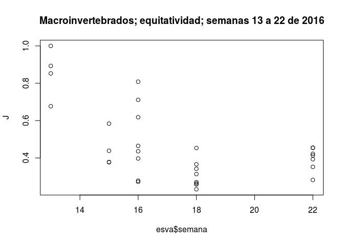
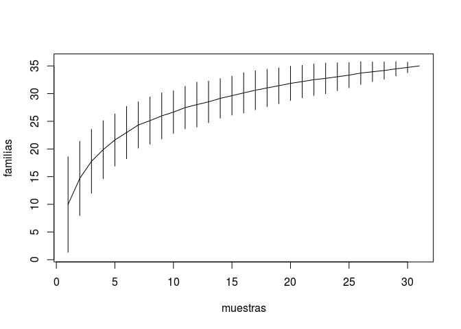
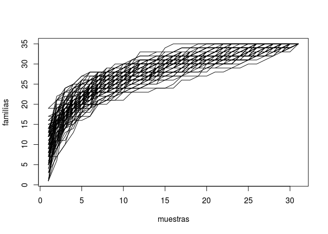
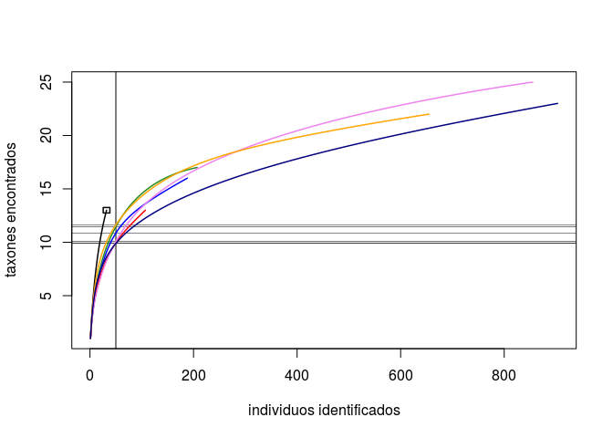
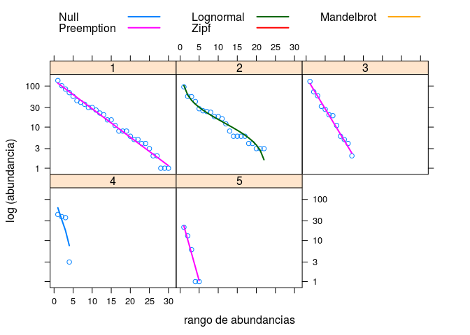
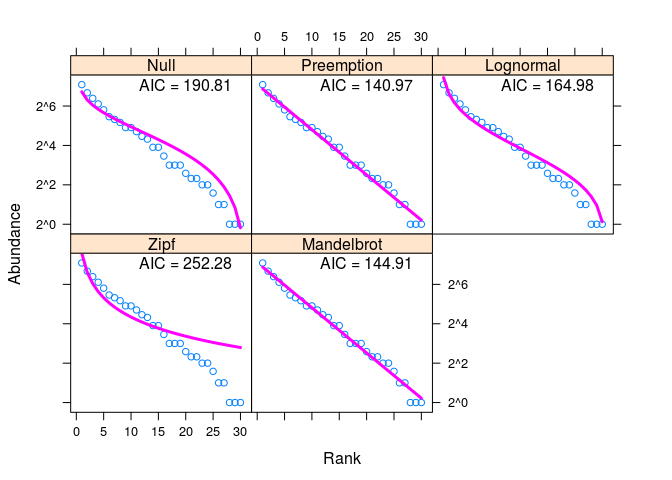
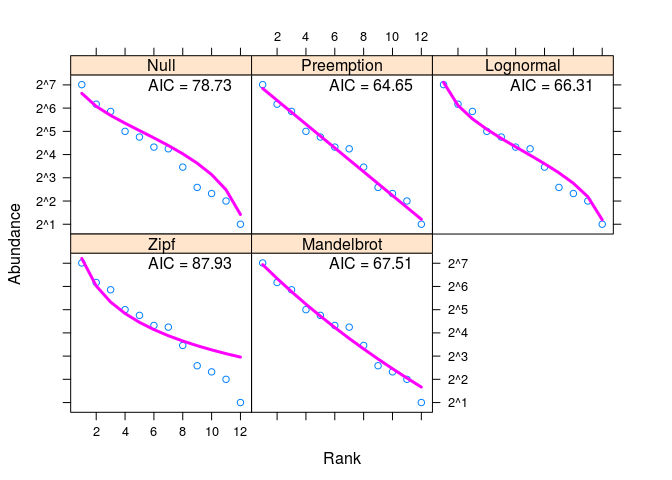

Comunidades
================
Mario Quevedo
March 5, 2019

Introducción al análisis de comunidades ecológicas en R
-------------------------------------------------------

El título de este tutorial es un ejemplo de la laxitud del término *comunidad*. Rara vez podemos obtener datos de comunidades completas; los datos se referirán más frecuentemente a *taxocenosis*, o a porciones más o menos arbitrarias de una comunidad ecológica local. En este caso tenemos dos conjuntos de datos: invertebrados fluviales en Asturias, y aves en la Sierra Nevada española.

Antes de entrar a analizar datos, es siempre recomendable echarles un vistazo, especialmente si trabajamos con datos recogidos por otros. Para entender la estuctura de los datos que luego cargaremos para el análisis, lo más fácil es abrir la hoja de cálculo **comunidades.xls** (preparada en LibreOffice pero válida para MS Excel). El archivo incluye varias hojas de cálculo:

-   **esva** contiene datos de abundancia de familias de invertebrados fluviales durante varios muestreos semanales en primavera de 2016, en el [río Esva (occidente de Asturias)](https://es.wikipedia.org/wiki/R%C3%ADo_Esva); formaron parte del TFG de Sara Fernández Rodríguez. Las columnas son los taxones encontrados en las muestras, así como variables adicionales como pH o turbidez del agua.

-   **semanas** agrega los datos de **esva** por semana y localidad de muestreo.

-   **sierra** contiene parte de los datos utilizados en la Práctica de Aula *Diversidad*; concretamente las abundancias de aves a 5 altitudes en la Sierra Nevada española.

-   **esva\_vegan**, **semanas\_vegan** y **sierra\_vegan** son versiones simplificadas de las anteriores, conservando solo las abundancias de invertebrados por requisitos de formato de algunas funciones en R.

### Configuración previa

Los procedimientos incluidos a continuación asumen que tenéis instalados [R](https://www.r-project.org/) y [RStudio](https://www.rstudio.com/), y que trabajaréis en este último. Instrucciones al respecto se encuentran en el apartado *Configuración* del módulo **Ecología en código abierto** del Campus Virtual.

### Carga de datos

Cambiad la carpeta de trabajo a aquella que contenga los archivos de datos (no es imprescindible, pero por el momento facilita el trabajo). En RStudio, `Session :: Set Working Directory :: Choose Directory...`

A continuación, cargad los datos con la línea de código siguiente, o bien haciendo doble *click* sobre el archivo en el explorador.

``` r
load("communities_DATA.RData")
```

El archivo con extensión **RData** contiene las hojas de datos (`data.frame` es el término en la jerga de R).

Para ver los datos ya en **RStudio** podemos usar la pestaña **Environment**; esta muestra los distintos conjuntos de datos disponibles en memoria, tras cargar el archivo **RData** anterior. Un icono con forma de tabla sirve para mostrar los datos. A medida que obtengamos resultados, estos pasarán a estar disponibles también en memoria para ser reutilizados, y aparecerán en ese listado.

Puede costar acostumbrarse a la presentación cruda de datos en R; para eso tenemos los mismos datos en la hoja de cálculo **comunidades.xls**. En este caso los datos ya están cargados, pero en **RStudio** es sencillo importar datos en varios formatos, incluido el de MS Excel, a través de `File :: Import dataset`.

------------------------------------------------------------------------

### Estructura de comunidades

Las funciones más específicas en R están incluidas en librerías adicionales, *packages* en jerga R. Una de esas librerías, diseñada específicamente para calcular métricas de comunidades, es [**vegan**](https://www.rdocumentation.org/packages/vegan/versions/2.4-2).

Para instalarla podéis usar los menús de RStudio (`Tools :: Install Packages`, escribiendo *vegan* en el cuadro de diálogo). Lo mismo se consigue con el código `install.packages("vegan", dependencies = TRUE)`. Este se leería en "humano" *instala vegan y otras librerías de las que dependa para funcionar*.

Una vez instalada, habilitamos la librería con:

``` r
library(vegan)
```

#### Índices de diversidad

Algunas funciones típicas de ecología de comunidades son los **índices de diversidad**. La línea de código siguiente usa la función `diversity` incluida en la libreria de funciones `vegan` para calcular los índices de diversidad de Shannon de cada muestra (fila) de la hoja de datos **esva\_vegan**. Además de calcularlos, los almacena en memoria en un objeto llamado **H**:

``` r
(H <- diversity (esva_vegan, index="shannon"))
```

    ##  [1] 1.5229551 0.0000000 1.3321790 1.7074754 1.4451484 1.9079826 1.6440866
    ##  [8] 1.9032217 1.4556827 1.4819703 1.4278916 1.6449917 0.9002561 1.2624264
    ## [15] 1.7829506 1.2916445 1.5778513 1.4054709 1.5437592 1.0821209 2.0250496
    ## [22] 2.0499721 1.6301058 2.0142427 2.2228320 2.1946404 1.9902080 1.9809018
    ## [29] 2.0026461 1.8218454 1.8729043

Usamos en este caso **esva\_vegan** porque las funciones de análisis de comunidades requieren hojas de datos exclusivamente numéricas, conteniendo solamente las abundancias por taxón.

A continuación, calculamos y almacenamos los índices de diversidad de Simpson en un objeto llamado **D**.

``` r
D <- diversity (esva_vegan, index="invsimpson")
```

Observaréis que en este caso no vemos los valores de la D de Simpson. Rodear una orden entre paréntesis, como en el caso anterior, implica mostrar en la consola el resultado, además de guardarlo en memoria. Si queremos ver los valores de diversidad de Simpson, escribimos simplemente `D` en la consola (o los vemos en la pestaña **Environment**).

Almacenamos también la riqueza de especies en un objeto llamado **S**, aprovechando la función `specnumber`, que devuelve el número de taxones para cada muestra (fila) de la hoja de datos:

``` r
(S <- specnumber(esva_vegan))
```

    ##  [1]  5  1  4  7  8  9  9 12 10  5  7 12  3  6  8  7 12 10 12  8 15 13 14
    ## [24] 14 19 16 14 14 13 11 17

Usando ahora R como una calculadora, obtenemos la equitatividad en *versión Simpson* (se leería *asigna a J el resultado de dividir D por S*):

``` r
J <- D/S
```

¿Cómo varía la equitatividad de la comunidad durante el muestreo? Para obtener una primera impresión del contenido de los datos podemos *pintar* esa equitatividad que acabamos de calcular frente al ordinal de la semana de muestreo.

El código a continuación se leería: *Pinta J frente a la semanda de muestreo, contenida en la columna "semana" de la hoja **esva***. El código añade también un título al gráfico, opcional.

``` r
plot (J ~ esva$semana, main="Macroinvertebrados; equitatividad; semanas 13 a 22 de 2016")
```



#### Acumulación de taxones en función del esfuerzo de muestreo

Una función para calcular la función de *rarefacción* es `specaccum`. El código a continuación calcula la curva a partir de permutar las muestras 100 veces, y la almacena en `tax_acum` (podemos usar cualquier nombre para los objetos creados). A continuación la pinta con `plot`, definiendo las etiquetas de los ejes X e Y con `xlab` `ylab`:

``` r
tax_acum <- (specaccum (esva_vegan,  method="random", permutations = 100)) 
plot (tax_acum, xlab = "muestras", ylab = "familias")
```

 El gráfico muestra el valor central de la curva de acumulación de especies; las barras indican la variación alrededor de ese valor central. Dicho de otra forma, para cada número de muestras tendremos un promedio de especies esperables, y unos intervalos de confianza resultantes de las 100 permutaciones de los datos.

Observamos en la "comunidad" estudiada la esperable curva asintótica de acumulación de taxones en función del esfuerzo de muestreo o análisis. En este caso es bastante gradual, si bien muestra un cambio de pendiente a partir de 6 - 8 muestras. El esfuerzo de muestreo debería ser superior a ese número de muestras para representar adecuadamente la diversidad de la comunidad.

Una interpretación más naturalista: 10 muestras obtenidas con pescas de red Surber en un río cantábrico encontraron entre 20 y 30 familias distintas de invertebrados de agua dulce.

Es posible también *pintar* todas las permutaciones en lugar de la media e intervalos de confianza. Se consigue añadiendo `random = TRUE` a aquella orden `plot`:

``` r
plot (tax_acum, xlab = "muestras", ylab = "familias", random = TRUE)
```



#### Acumulación de taxones por individuos

La función `rarecurve` calcula y pinta la acumulación de taxones en función del número de individuos.

``` r
rarecurve(semanas_vegan, sample = 50, col =  c("black", "forestgreen", "blue", "red", "violet", "orange", "navy"),lwd = 1.5, xlab="individuos identificados", ylab="taxones encontrados")
```

 La línea vertical marca el tamaño muestral de referencia, especificado en el código con la opción `sample=`. las líneas horizontales muestran la riqueza de especies correspondiente a ese tamaño de muestra de referencia.

Las posibilidades de análisis son exhaustivas. Podemos por ejemplo extraer con facilidad la pendiente de las curvas para un determinado número de individuos identificados; 20 y 50 en este caso:

``` r
rareslope(semanas_vegan, sample=c(20,50))
```

    ##            N20        N50
    ## [1,] 0.2765801 0.00000000
    ## [2,] 0.1896223 0.08871895
    ## [3,] 0.1871894 0.07662702
    ## [4,] 0.1533780 0.07192327
    ## [5,] 0.1594760 0.08721711
    ## [6,] 0.1731237 0.07258878
    ## [7,] 0.1379084 0.05808134

Un vistazo a **semanas** ayuda a recordar a qué datos corresponden esos resultados, presentados por filas.

#### Curvas diversidad-dominancia

Los *rangos de abundancias* o curvas deversidad-dominancia se utilizan en la comparación de comunidades basada en la equitatividad. Comunidades en las que los individuos estén más distribuidos entre distintas especies, en lugar de dominadas por muchos individuos de algunas, presentarán pendientes menores.

Para que esa comparación no sea meramente cualitativa, *a ojo*, podemos ajustar modelos numéricos a los datos. La función `radfit` ajusta varios modelos de curvas diversidad-dominancia, incluyendo los vistos en clase *reserva de nicho* (*preemption*) y el de *fracción aleatoria o broken-stick* (*null*).

El código a continuación estima con `radfit` que modelo se ajusta mejor a cada una de las 5 altitudes de Sierra Nevada, y los pinta con `plot`.

``` r
modelos_sierra <- radfit (sierra_vegan)
plot (modelos_sierra, xlab="rango de abundancias", ylab="log (abundancia)")
```



Una evaluación puramente visual de los datos podría llevarnos a interpretar que el panel 1 (1300 m) y el 5 (3100) corresponden a modelos distintos, ya que la comunidad de aves a 1300 metros es más rica en especies, y aparentemente más equitativa. No obstante, ambos conjuntos de datos se ajustan mejor al modelo de *reserva de nicho*, denominado *preemption* en R.

Es posible usar la misma función con una parte de los datos, por ejemplo una altitud (o fila). La salida a continuación indica el ajuste numérico de los modelos a los datos abundancia de aves a 1300 m s.n.m., almacenados en la fila 1 de la hoja **sierra\_vegan**. Interpretar esa salida se escapa de los contenidos del curso, pero esencialmente el mejor ajuste se produce cuando la desviación de los datos al modelo es mínima (*Deviance*):

``` r
(modelo_1300 <- radfit (sierra_vegan [1,]))
```

    ## 
    ## RAD models, family poisson 
    ## No. of species 30, total abundance 794
    ## 
    ##            par1     par2        par3        Deviance AIC      BIC     
    ## Null                                         60.8833 190.8125 190.8125
    ## Preemption  0.14718                           9.0421 140.9713 142.3725
    ## Lognormal   2.6233   1.1922                  31.0554 164.9846 167.7870
    ## Zipf        0.24157 -0.97564                118.3544 252.2836 255.0860
    ## Mandelbrot    Inf   -1.0791e+05  6.7811e+05   8.9850 144.9142 149.1178

`plot (modelo_1300)` pinta los 5 modelos superpuestos a los datos del 1300 m s.n.m. En este caso puede resultar más clara una representación en rejilla:

``` r
radlattice (modelo_1300)
```



Y el equivalente para 2180 m, cuyos datos están en la fila 3 de los datos **sierra\_vegan**:

``` r
(modelo_2180 <- radfit (sierra_vegan [3,]))
```

    ## 
    ## RAD models, family poisson 
    ## No. of species 12, total abundance 385
    ## 
    ##            par1        par2    par3    Deviance AIC     BIC    
    ## Null                                   22.6651  78.7322 78.7322
    ## Preemption  0.29887                     6.5806  64.6477 65.1326
    ## Lognormal   2.8777      1.1844          6.2430  66.3102 67.2800
    ## Zipf        0.3835     -1.1854         27.8673  87.9344 88.9042
    ## Mandelbrot  1.6055e+09 -7.7089  17.138  5.4438  67.5110 68.9657

``` r
radlattice (modelo_2180)
```


