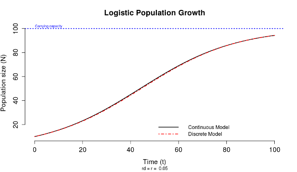

Introducción. Crecimiento exponencial y logístico
================
Enero de 2019

#### Pasos previos y requisitos de software

Para desarrollar el taller necesitais **R** y **RStudio**, así como las
librerías **Rcmdr** y **RcmdrPlugin.EcoVirtual** (ver Instrucciones de
configuración
<https://github.com/quevedomario/eco3r/blob/master/config.md>). -
Arrancad RStudio. - En la consola, arrancad el interfaz guiado **R
Commander** con la instrucción `library(Rcmdr)` seguida de la tecla
*intro*.

  - A continuación cargad el *plugin* **EcoVirtual** a través del menú
    **Tools :: Load Rcmdr plugin(s)**, y aceptad el mensaje de reinicio
    de R Commander.

Tras el reinicio de **Rcmdr** aparecerá una nueva entrada **EcoVirtual**
en la barra de menús, a su vez dividida en varios modelos de
poblaciones: una población, metapoblaciones, dos especies
(interacciones), múltiples especies, modelos biogeográficos.

#### Crecimiento exponencial

El primer ejercicio simula el caso más simple de crecimiento de una
población: aquel que puede tener lugar sin la influencia de la
competencia intraespecífica, y sin la influencia de las interacciones
con poblaciones de otras especies (competidores, predadores,
mutualistas).

Usad el modelo **EcoVirtual :: One Population :: Exponential…**. El
cuadro de diálogo de ese módulo muestra valores por defecto que sirven
para comenzar:
\* Tiempo de duración de la simulación (**Maximum
time**)  
\* Tamaño inicial de población del que queremos partir (**Initial
population size**)  
\* Tasa de crecimiento que queremos simular (**Population growth rate**)

Otro aspecto importante en ese cuadro de dialogo es el intervalo de
tiempo con el que queremos trabajar (**Interval time size**); cada
cuanto tiempo se evalúa el cambio de la población. Si simulamos
poblaciones en las que la incorporación de nuevos individuos se produce
en *momentos concretos* como temporadas de cría, periodos de germinación
de semillas, etc., usaremos un *modelo de crecimiento discreto*. Si en
cambio la población puede incorporar individuos en cualquier momento,
nos interesará un modelo de crecimiento continuo. El modulo
**Exponential** de **EcoVirtual** ofrece resultados desde ambos puntos
de vista, y permite ajustar el **Interval time size** si es necesario.

Aceptando los valores por defecto con el botón **OK** el módulo genera
dos resultados o salidas: por un lado, la ventana R Commander muestra el
código correspondiente a esa simulación, que podríamos guardar y
reutilizar:

`popExp(N0 = 10, lamb = 1.05, tmax = 10, intt = 1)`

Por otro lado en la ventana de **RStudio**, vemos el mismo código
ejecutado en la consola, y la salida gráfica correspondiente.

Los puntos azules en esa gráfica indican el *tamaño proyectado* de la
población en cada intervalo de tiempo *discreto*, fijado con **Interval
time size**. La línea continua muestra la dinámica de la población según
un *modelo continuo*, en el que el incremento de la población sería
instantáneo.

Podemos visualizar simultáneamente la versión discreta y continua del
crecimiento exponencial porque las tasas de crecimiento discreta (**ʎ**)
y continua (**r**), también llamada *intrínseca* o *per cápita*, son
fácilmente convertibles: *r = ln (ʎ)*

El modelo simulado se interpreta como una población que crecería en un
porcentaje determinado **Population growth rate = 1.05 (5%)** en cada
intervalo de tiempo **Interval time size = 1**, o con una tasa de
crecimiento intrínseca **r = 0.049** según un modelo continuo.

Modificaciones de los parámetros del modelo exponencial nos permitirán
simular otras situaciones, ya sea ejecutando de nuevo la interfaz guiada
en R Commander con **EcoVirtual :: One Population :: Exponential…**, o
directamente sirviéndonos del código disponible también en R Commander.
Para probar esa última opción, comprobad el resultado de simular una
población con una tasa de crecimiento discreta *λ (lambda)* ligeramente
inferior a 1, modificando el parámetro correspondiente en el código:

Una vez modificado el código, el botón **Submit** envía el código a
RStudio, y ejecuta la nueva simulación. El gráfico resultante estará
disponible entonces en RStudio.

Fijaos una vez más que la salida gráfica muestra la tasa discreta, y la
correspondiente continua o intrínseca **r = -0.01**. Una población con
dinámica estable mostrará valores de *λ* muy próximos a 1, y valores de
*r* muy próximos a 0.

Pregunta: ¿de mantenerse la tasa de crecimiento **λ= 0.99**, se
extinguirá la población estudiada en 100 años?

Para contestarla copiad la linea de código que muestra R Commander a la
consola, y modificad allí los parámetros necesarios. El código
introducido (o pegado) en la consola se ejecuta con la tecla Enter /
Intro.

Entre las facilidades de manejar R desde RStudio está la exportación de
resultados. Las gráficas producidas por los modelos *lanzados* desde R
Commander se exportan fácilmente desde el menú situado sobre las
gráficas, incluyendo la posibilidad de copiarlas al portapapeles (*copy
to clipboard*) para pegarlas inmediatamente en un documento.

#### Crecimiento logístico

El crecimiento exponencial es un modelo muy simple del crecimiento de
poblaciones, si bien puede resultar apropiado (realista) durante
periodos limitados de tiempo. Para añadir algo de realismo al modelado
del cambio en el tiempo de las poblaciones, podemos tratar de incorporar
*competencia intraespecífica*. Ese es el objetivo del modelo logístico
de crecimiento:

La parte izquierda de la ecuación, *dN/dt*, indica que modelamos cambios
de población en intervalos muy pequeños de tiempo (*diferencial de N
respecto a diferencial de t*). Por eso en la parte derecha de la
ecuación encontramos *r*, la tasa intrínseca de crecimiento.

Estamos simulando poblaciones que incorporan o pierden individuos de
forma continua, a partir de la mencionada tasa intrínseca de
crecimiento, el tamaño poblacional en el momento previo **N**, y la
**capacidad de carga K**. Este último parámetro indica el tamaño de la
población a partir del cual la mortalidad supera a la natalidad, como
consecuencia de la competencia intraespecífica.

El modelo logístico se activa en RCommander con **EcoVirtual :: One
Population :: Logistic Growth…**

Ejecutando la simulación con los valores que aparecen por defecto al
lanzar el módulo, obtendremos en RStudio la siguiente curva:

El modelo logístico plantea que la densidad de población limita la tasa
intrínseca crecimiento de una población. Ese es el papel de la fracción
libre de la capacidad de carga en la ecuación *1-(N/K)*. Dicho
componente del modelo logístico es el responsable del cambio de
pendiente de la curva al cambiar la abundancia. La pendiente se aproxima
a 0 cuando el tamaño de la población e aproxima a la capacidad de carga
(en este caso **K = 100**).

Observando la curva, ¿a qué tamaño de población aproximado corresponde
el máximo crecimiento de la población?

Esa pregunta la podéis abordar numéricamente resolviendo la ecuación del
modelo logístico para distintos tamaños poblacionales; por ejemplo *N =
10, N = 50, N = 90, N = 120*. La consola de R y RStudio funciona también
como una calculadora. El código siguiente seguido de la tecla intro
proporciona el incremento de la población para **N = 10 (con r = 0.05 y
K = 100)**:

`(0.05*10)*(1-(10/100))`

El gráfico anterior muestra simultáneamente la curva correspondiente a
la ecuación del modelo logístico, así como la correspondiente a una
versión discreta de la influencia de la densidad en el crecimiento
poblacional. En el caso de los parámetros seleccionados, las curvas son
coincidentes. Sin embargo, en poblaciones con *eventos discretos de
reproducción* existe normalmente un retraso en la respuesta a la
densidad de población, que puede implicar que la abundancia de la
población supere temporalmente la capacidad de carga.

Los modelos discretos que incorporan la influencia de la densidad en el
crecimiento de poblaciones suelen incorporar el retraso en la respuesta
a la densidad de población, y no los tratamos en Ecología de 3º. Sin
embargo el modulo **Logistic Growth** disponible en R Commander permite
simular esta idea para tasas de crecimiento muy altas. La Gráfica 3
muestra las curvas continua y discreta resultantes de simular
crecimiento logístico con **r = 1.9**, y **tmax = 20**. En la curva
discreta la tasa de crecimiento muy elevada implica que *el tamaño de la
población en el eje Y supera temporalmente la capacidad de carga*, dando
lugar a dinámicas con oscilaciones.

