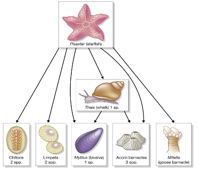
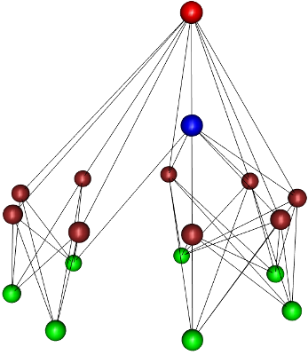
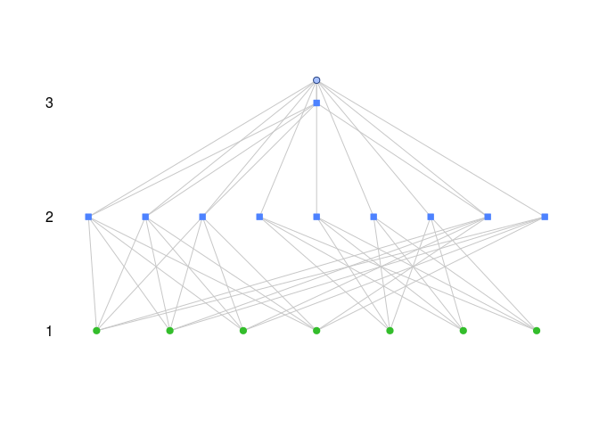
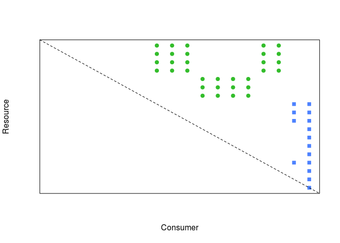
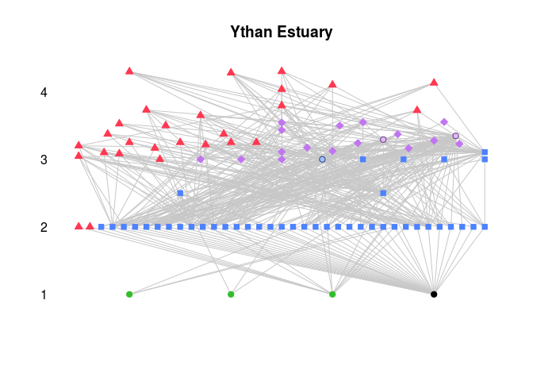
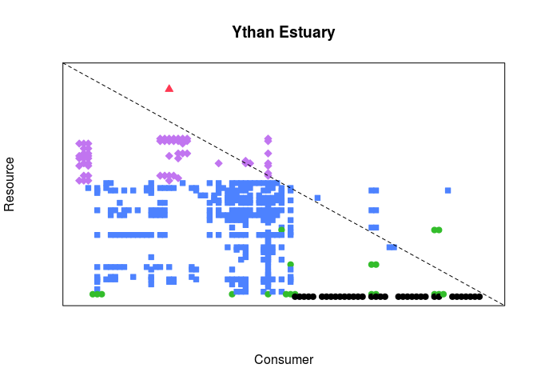

Redes
================
Mario Quevedo
March 5, 2019

Introducción al análisis de redes de interacciones en R
-------------------------------------------------------

### Configuración previa

Desgarga de **redes.zip**, descomprimirlo en la carpeta deseada del disco duro, y cambiar el directorio de trabajo de RStudio a esa carpeta.

Instalación de las librerías `bipartite`, `cheddar` y `foodweb` con `Tools :: Install packages...` en RStudio, o con la línea de código `install.packages(c("bipartite", "cheddar", "foodweb"), dependencies = TRUE)`. En caso de estar ya instaladas, la orden reemplazará las librerías por las versiones más recientes.

### Los datos

La siguiente línea de código carga los datos de la práctica (asumiendo que están en la carpeta de trabajo).

``` r
load("redes.RData")
```

La misma operación a través de la barra de menús sería `File :: Open file...`

Un vistazo a la pestaña **Environment** muestra varios conjuntos de datos. Entre ellos **paine** (tipo = *data.frame*) muestra los enlaces tróficos del famoso experimento de Paine<sup>1</sup>, con el añadido simulado de 8 tipos de productores primarios.

 <sup>1</sup> Townsend et al. 2008. Fig. 10-07

### Visualización de redes tróficas en 3D

La librería [*foodweb*](http://www.rdocumentation.org/packages/foodweb) genera esquemas de redes tróficas tridimensionales e interactivos. No obstante, usa un código enrevesado y no está actualizada, por lo que usaremos solo su función de visualización.

El código `analyse.single(filename = "foodweb_pkg_paine0.csv")` analiza las propiedades básicas de la red, almacenándolas en un archivo de texto en la carpeta de trabajo. Es necesario ejecutarlo para que la siguiente función `plotweb()` funcione, pero usaremos otra librería más adelante para las métricas.

El formato de datos requerido por `analyse.single()` es una matriz de vínculos como la de **paine**, pero sin nombres de filas y columnas.

``` r
plotweb (col=c("red", "orange", "blue", "green"), radii=c(15,15,15,15))
```

`plotweb()` abrirá una ventana nueva con el esquema *paine* en 3D. Tras maximizarla, es posible hacer *zoom* y rotar la red con el ratón. La función solo define los colores y radios de cada nivel trófico.



### Análisis de propiedades de redes tróficas

La librería [*cheddar*](https://www.rdocumentation.org/packages/cheddar) proporciona muchas funciones específicas de análisis gráfico y numérico de redes tróficas. Incluye además datos de ejemplo de redes tróficas bien conocidas.

Habilitamos la librería:

``` r
library(cheddar)
```

Entre los datos cargados previamente está *paine\_cheddar*; contiene la red trófica simple usada con la librería `foodweb`, y adaptada al formato requerido por `cheddar`. Dicho formato, identificado como *Community* en el entorno de trabajo o *Environment*, parte de tres archivos de texto contenidos en la carpeta *foodweb\_paine*, y que se leerían con `paine_cheddar <- LoadCommunity(dir="foodweb_paine")` (no es necesario al estar incluidos en **redes.RData**).

A diferencia de `foodweb`, la librería `cheddar` es fácil de usar, a pesar de contener muchas funciones (ayuda fácilmente accesible en la documentación de la librería). La función `TLPS()` devuelve los vínculos tróficos (en este caso ordenados alfabéticamente por *resource*).

``` r
head(TLPS(paine_cheddar))
```

    ##        resource consumer
    ## 1 fitoplancton1 bellota1
    ## 2 fitoplancton1 bellota2
    ## 3 fitoplancton1 bellota3
    ## 4 fitoplancton1 mejillon
    ## 5 fitoplancton1  percebe
    ## 6 fitoplancton2 bellota1

La siguiente línea comprueba si hay algún nodo canibal. Devuelve **TRUE** para *Pisaster*:

``` r
IsCannibal(paine_cheddar)
```

    ## fitoplancton1 fitoplancton2 fitoplancton3 fitoplancton4   fitobentos1 
    ##         FALSE         FALSE         FALSE         FALSE         FALSE 
    ##   fitobentos2   fitobentos3      bellota1      bellota2      bellota3 
    ##         FALSE         FALSE         FALSE         FALSE         FALSE 
    ##       quiton1       quiton2         lapa1         lapa2      mejillon 
    ##         FALSE         FALSE         FALSE         FALSE         FALSE 
    ##       percebe         thais      pisaster 
    ##         FALSE         FALSE          TRUE

#### Pintando la red trófica

En este caso la altura de los nodos es consecuencia de la posición trófica, no del nivel como en `foodweb`

``` r
PlotWebByLevel(paine_cheddar, main="")
```



#### Matriz de predación

`cheddar` permite extraer fácilmente la *matriz de predación*, resumen bidimensional de interacciones similar a las matrices vistas en redes bipartitas para evaluar anidamiento:

``` r
PlotPredationMatrix(paine_cheddar, main="")
```



La línea diagonal discontinua toca los nodos caníbales, en este caso *Pisaster*.

#### Métrica básica de la red

Número de nodos en la red (**S**)

``` r
NumberOfNodes(paine_cheddar)
```

    ## [1] 18

Vínculos tróficos (**L**)

``` r
NumberOfTrophicLinks(paine_cheddar)
```

    ## [1] 47

Densidad de vínculos y conectancia (**L/S**, **C**)

``` r
LinkageDensity(paine_cheddar)
```

    ## [1] 2.611111

``` r
DirectedConnectance(paine_cheddar)
```

    ## [1] 0.1450617

Fracción de nodos basales, omnívoros y caníbales:

``` r
FractionBasalNodes(paine_cheddar)
```

    ## [1] 0.3888889

``` r
FractionOmnivorous(paine_cheddar)
```

    ## [1] 0.05555556

``` r
FractionCannibalistic(paine_cheddar)
```

    ## [1] 0.05555556

Y la posición trófica de cada nodo, utilizada en `PlotWebByLevel`

``` r
PreyAveragedTrophicLevel(paine_cheddar) 
```

    ## fitoplancton1 fitoplancton2 fitoplancton3 fitoplancton4   fitobentos1 
    ##           1.0           1.0           1.0           1.0           1.0 
    ##   fitobentos2   fitobentos3      bellota1      bellota2      bellota3 
    ##           1.0           1.0           2.0           2.0           2.0 
    ##       quiton1       quiton2         lapa1         lapa2      mejillon 
    ##           2.0           2.0           2.0           2.0           2.0 
    ##       percebe         thais      pisaster 
    ##           2.0           3.0           3.2

#### Una red trófica completa

`cheddar` incluye varias redes tróficas reales, publicadas, como ejemplo de las posibilidades de análisis. Una de ellas corresponde al [estuario de Ythan](https://en.wikipedia.org/wiki/Ythan_Estuary), en Escocia. Muchas de las especies incluidas aparecen también en el norte de la Península Ibérica.

Para cargar esos datos de ejemplo:

``` r
data("YthanEstuary")
```

**YthanEstuary** aparecerá en el entorno de trabajo, disponible para usarlo con las funciones de `cheddar`. Por ejemplo, repasando qué nodos contiene con `NPS()` (si bien limitando la salida a las 6 primeras filas con `head()`:

``` r
head(TLPS(YthanEstuary))
```

    ##                 resource            consumer
    ## 1      Anguilla anguilla         Lutra lutra
    ## 2       Pholis gunnellus         Lutra lutra
    ## 3      Zoarces viviparus         Lutra lutra
    ## 4 Myoxocephalus scorpius         Lutra lutra
    ## 5           Salmo trutta         Lutra lutra
    ## 6      Anguilla anguilla Phalacrocorax carbo

O pintando la red, mucho más compleja que la simulación en **paine**:

``` r
PlotWebByLevel(YthanEstuary)
```



Y la matriz de predación:

``` r
PlotPredationMatrix(YthanEstuary)
```


