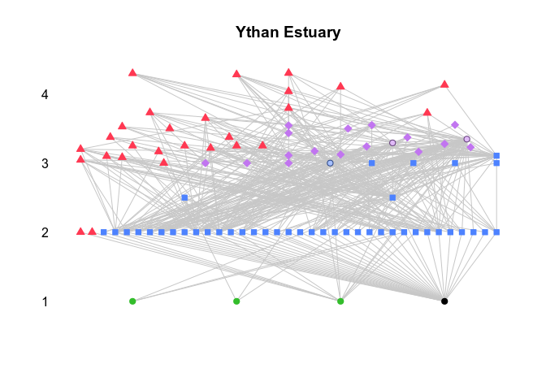

Introducción al análisis de redes tróficas en R
================
Marzo 2019

### Configuración previa

El ejercicio requiere la instalación de las librerías `cheddar` y
`foodweb`, ya sea con los menús `Tools :: Install packages...` en
RStudio, o con la línea de código `install.packages(c("cheddar",
"foodweb"), dependencies = TRUE)`. En caso de estar ya instaladas, la
orden reemplazará las librerías por las versiones más recientes (la
función `installed.packages()` devuelve un listado de las librerías ya
instaladas y sus versiones).

### Los datos

Los datos usados en este ejercicio están en el archivo comprimido (Ctrl.
+ clic)
[**redes.zip**](https://github.com/quevedomario/eco3r/blob/master/redes.zip).
Al descomprimirlo en la carpeta de trabajo, mostrará 4 archivos de datos
separados por comas (csv), 3 de ellos dentro de una carpeta
*foodweb\_paine*. Corresponden a los enlaces tróficos del experimento de
Paine<sup>1</sup> excluyendo a la estrella de mar *Pisaster
ochraceus*<sup>2</sup> de charcas de marea, con el añadido simulado de 8
tipos de productores primarios.


### Visualización de redes tróficas

La librería **foodweb** dibuja **diagramas tridimensionales e
interactivos de redes tróficas**, y extrae métricas habituales en el
estudio de las mismas. Sin embargo, no está actualizada, por lo que
usaremos solo su función de visualización. Para obtener las métricas
usaremos después otra librería.

``` r
library(foodweb)
```

    ## Loading required package: rgl

Para dibujar el diagrama de la red trófica<sup>3</sup> usamos la función
`plotweb()`. Esta abrirá una ventana nueva con diagrama en 3D. Tras
maximizar la ventana, es posible usar el ratón para hacer *zoom* y rotar
la red. La función solo define los colores y radios de cada nivel
trófico.

``` r
plotweb (col=c("red", "orange", "blue", "green"), radii=c(15,15,15,15))
```


Un vistazo a la representación 3D de esta red trófica simplificada
muestra **4 niveles tróficos, omnivoría, y dos compartimentos claros**,
definidos por productores primarios bentónicos y planctónicos, y
consumidores raspadores y filtradores.

### Análisis de propiedades de redes tróficas

La librería **cheddar**<sup>4</sup> proporciona funciones específicas de
análisis gráfico y numérico de redes tróficas; la usaremos para obtener
las métricas de la red trófica de *Pisaster*.

``` r
library(cheddar)
```

Para cargar la red trófica adaptada al formato requerido por la librería
`cheddar` es necesario usar la función `LoadCommunity()`; esta accede a
los tres archivos de texto de la carpeta *foodweb\_paine*. Almacenamos
los datos en **paine\_cheddar**.

``` r
paine_cheddar <- LoadCommunity(dir="foodweb_paine")
```

`cheddar` contiene muchas funciones, pero estas son generalmente fáciles
de usar. Por ejemplo, la función `TLPS()` devuelve los **vínculos
tróficos** entre las especies o nodos de la red. `head()` limita la
presentación de datos en la salida a las 6 primeras filas:

``` r
head(TLPS(paine_cheddar))
```

    ##   resource consumer
    ## 1  balano1 pisaster
    ## 2  balano1    thais
    ## 3  balano2 pisaster
    ## 4  balano2    thais
    ## 5  balano3 pisaster
    ## 6  balano3    thais

Las proporciones de nodos caníbales y omnívoros son susceptibles de
variar mucho entre distintas comunidades, entre otros factores en
función de la productividad, y por ello son objeto habitual de
análisis. Las siguientes líneas comprueban si hay **nodos caníbales y
omnívoros** en la red de
    *Pisaster*:

``` r
IsCannibal(paine_cheddar)
```

    ## fitoplancton1 fitoplancton2 fitoplancton3 fitoplancton4   fitobentos1 
    ##         FALSE         FALSE         FALSE         FALSE         FALSE 
    ##   fitobentos2   fitobentos3       balano1       balano2       balano3 
    ##         FALSE         FALSE         FALSE         FALSE         FALSE 
    ##       quiton1       quiton2         lapa1         lapa2      mejillon 
    ##         FALSE         FALSE         FALSE         FALSE         FALSE 
    ##       percebe         thais      pisaster 
    ##         FALSE         FALSE          TRUE

``` r
IsOmnivore(paine_cheddar)
```

    ## fitoplancton1 fitoplancton2 fitoplancton3 fitoplancton4   fitobentos1 
    ##         FALSE         FALSE         FALSE         FALSE         FALSE 
    ##   fitobentos2   fitobentos3       balano1       balano2       balano3 
    ##         FALSE         FALSE         FALSE         FALSE         FALSE 
    ##       quiton1       quiton2         lapa1         lapa2      mejillon 
    ##         FALSE         FALSE         FALSE         FALSE         FALSE 
    ##       percebe         thais      pisaster 
    ##         FALSE         FALSE          TRUE

Ambos casos devuelven **TRUE** para *Pisaster*, la única especie
identificada en la red como consumidora de individuos de su propia
especie, y de recursos de más de un nivel trófico.

#### Pintando la red trófica

A diferencia de los diagramas de la librería `foodweb` en este caso la
posición de los nodos es consecuencia de la posición trófica de los
mismos, no del nivel trófico. Por eso *Thais* y *Pisaster* aparecen más
cerca en este diagrama:

``` r
PlotWebByLevel(paine_cheddar, main="")
```

<!-- -->

#### Métricas básicas de la red

Número de nodos en la red (**S**)

``` r
NumberOfNodes(paine_cheddar)
```

    ## [1] 18

Número de vínculos tróficos (**L**)

``` r
NumberOfTrophicLinks(paine_cheddar)
```

    ## [1] 47

Densidad de vínculos y **conectancia** (**L/S**, **C**)

``` r
LinkageDensity(paine_cheddar)
```

    ## [1] 2.611111

``` r
DirectedConnectance(paine_cheddar)
```

    ## [1] 0.1450617

Fracción de nodos basales, omnívoros y caníbales:

``` r
FractionBasalNodes(paine_cheddar)
```

    ## [1] 0.3888889

``` r
FractionOmnivorous(paine_cheddar)
```

    ## [1] 0.05555556

``` r
FractionCannibalistic(paine_cheddar)
```

    ## [1] 0.05555556

Y la posición trófica de cada nodo, utilizada en
    `PlotWebByLevel`

``` r
PreyAveragedTrophicLevel(paine_cheddar) 
```

    ## fitoplancton1 fitoplancton2 fitoplancton3 fitoplancton4   fitobentos1 
    ##           1.0           1.0           1.0           1.0           1.0 
    ##   fitobentos2   fitobentos3       balano1       balano2       balano3 
    ##           1.0           1.0           2.0           2.0           2.0 
    ##       quiton1       quiton2         lapa1         lapa2      mejillon 
    ##           2.0           2.0           2.0           2.0           2.0 
    ##       percebe         thais      pisaster 
    ##           2.0           3.0           3.2

#### Una red trófica completa

`cheddar` incluye varias redes tróficas reales, publicadas, como ejemplo
de las posibilidades de análisis. Una de ellas corresponde al estuario
de Ythan<sup>5</sup>, en Escocia. Buena parte de las especies incluidas
aparecen también en el norte de la Península Ibérica.

Para cargar esos datos de ejemplo:

``` r
data("YthanEstuary")
```

**YthanEstuary** aparecerá en el entorno de trabajo. Repasamos por
ejemplo **qué vínculos tróficos contiene** con `TLPS()`, si bien
limitando la salida a las 6 primeras filas con `head()`.

``` r
head(TLPS(YthanEstuary))
```

    ##                 resource            consumer
    ## 1      Anguilla anguilla         Lutra lutra
    ## 2       Pholis gunnellus         Lutra lutra
    ## 3      Zoarces viviparus         Lutra lutra
    ## 4 Myoxocephalus scorpius         Lutra lutra
    ## 5           Salmo trutta         Lutra lutra
    ## 6      Anguilla anguilla Phalacrocorax carbo

Pintamos el diagrama de la red, que es mucho más compleja que la
simulación de *Pisaster*:

``` r
PlotWebByLevel(YthanEstuary)
```

<!-- -->

Densidad de vínculos y conectancia (**L/S**, **C**)

``` r
LinkageDensity(YthanEstuary)
```

    ## [1] 4.532609

``` r
DirectedConnectance(YthanEstuary)
```

    ## [1] 0.04926749

La red de Ythan Estuary muestra una **densidad de enlaces 1.7 veces
mayor** que la de *Pisaster*, y una **conectancia 2.9** veces menor.

La función usada anteriormente `IsCannibal()` identificará nodos
caníbales en la red. Para facilitar la revisión de los resultados, y
dado que la red contiene muchos nodos, podemos guardar la salida en un
objeto llamado por ejemplo **canibal**:

``` r
canibal <- IsCannibal(YthanEstuary)
```

A continuación convertimos esos resultados en un conjunto de datos con
`as.data.frame(canibal)`, para posteriormente filtrar los contenidos y
mostrar solo aquellos nodos etiquetados como caníbales con
    `TRUE`:

``` r
canibal[canibal==TRUE]
```

    ## Pomatoschistus microps     Platichthys flesus        Carcinus maenas 
    ##                   TRUE                   TRUE                   TRUE

Dos especies de peces, gobio<sup>6</sup> y platija<sup>7</sup>, y un
cangrejo<sup>8</sup> aparecen identificados como caníbales en esta red
trófica. Posiblemente un mayor nivel de resolución aportaría más
vínculos caníbales.

Para terminar, extraemos la fracción de nodos basales, omnívoros y
caníbales:

``` r
FractionBasalNodes(YthanEstuary)
```

    ## [1] 0.04347826

``` r
FractionOmnivorous(YthanEstuary)
```

    ## [1] 0.4565217

``` r
FractionCannibalistic(YthanEstuary)
```

    ## [1] 0.0326087

El 46% de los nodos de la red trófica de Ythan Estuary muestra vínculos
con más de un nivel trófico. Dicho de otra forma, **la omnivoría es
prevalente en una red trófica real como esta**.

### Enlaces, referencias, anotaciones de código

(Mejor con botón drcho. + abrir en nueva pestaña, o Ctrl. + clic)  
1\. Townsend et al. 2008. Essentials of Ecology. 3rd ed. Fig. 10-07.
Blackwell  
2\. <https://eol.org/pages/598469>  
3\. Para poder visualizar el diagrama de la red es necesario previamente
ejecutar la función que analiza las propiedades básicas de la red
trófica, aunque no usaremos esos resultados: `analyse.single (filename
= "foodweb_pkg_paine0.csv")` utiliza *foodweb\_pkg\_paine0.csv*, uno de
los archivos .csv contenidos en **redes.zip**. El formato de datos
requerido por `analyse.single()` es una matriz de vínculos tróficos sin
nombres de filas y columnas.  
4\. <https://www.rdocumentation.org/packages/cheddar>  
5\. <https://en.wikipedia.org/wiki/Ythan_Estuary>  
6\. <https://www.fishbase.de/summary/1344>  
7\. <https://www.fishbase.org/summary/Platichthys-flesus.html>  
8\. <https://www.marlin.ac.uk/species/detail/1497>
