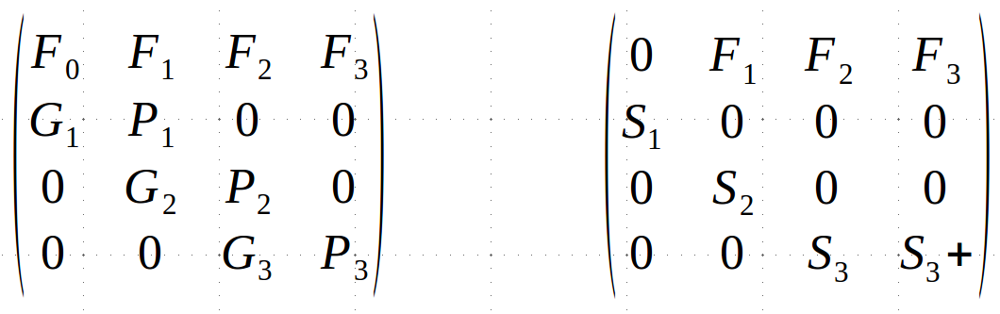
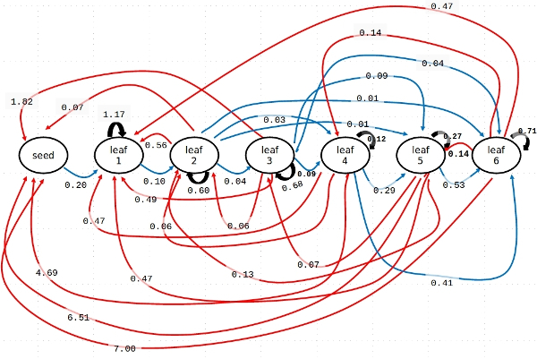

```{r setup, include=FALSE}
knitr::opts_chunk$set(echo = TRUE)
options(warn=-1)
```

### Librerias utilizadas
```{r message=FALSE, warning=FALSE}
library (popbio)
library(diagram)
library(pander)
```

### Introducción

Trabajamos con poblaciones en las que los individuos presentan características *a priori* contrastadas desde el punto de vista de la dinámica de la población, asociadas a su edad o estado fisiológico, ya sea por contribuir de forma diferencial a la reproducción o por presentar diferentes supervivencias. En líneas generales los modelos de poblaciones estructuradas los podemos representar mediante ciclos de vida:


Ese esquema genérico muestra una población modelada a partir de 4 tipos de individuos, agrupados en clases de edad o estadios - las "cajas". Las flechas indican las transiciones posibles entre clases o estadios. A ese ciclo de vida le correspondería la visión numérica aportada por las matrices de transición:



En la primera fila de las matrices de transición, ya sean de edades (dcha.) o de estadios (izda.), encontramos el *esquema de fecundidad*, expresada como promedio de individuos contribuidos al momento *t+1* producidos por cada individuo presente en el momento *t*. El resto de valores no nulos de la matriz representan probabilidades de supervivencia entre *t* y *t+1*, ya sea *permaneciendo* en el mismo estadio, e.g. *P~2~* en la matriz de estadios, o *creciendo* al siguiente, e.g. *G~3~* en estadios *S~2~* en edades.
 
### Matriz de proyección (estadios)
Para el ejercicio usamos datos de un modelo estructurado de orcas *Orcinus orca*, contenidos en la librería `popbio` (Caswell 2001)^1^. 

El código a continuación carga en memoria los datos **whale**, y visualiza a continuación la matriz. la visualización incluye un pequeño truco estético: la función `pander()` rodeando al conjunto de datos devuelve una matriz con un formato más enriquecido útil especialmente para la producción de informes en pdf o html; es opcional:

```{r}
data (whale)
pander (whale)
```

En el modelo la población está dividida en individuos de primer año **yearling**, juveniles no reproductores **juvenile**, individuos reproductores **mature**, y postreproductores **postreprod**. Este último estadio es muy peculiar: muy pocas especies en la naturaleza conservan aquellos individuos que han dejado de contribuir a la reproducción^2^. 

No es una sorpresa que **yearling** no contribuya a la reproducción, y tampoco lo será en el caso de **postreprod**, definidos precisamente por habert alcanzado la menopausia. Algo más sorprendente será la pequeña proporción de individuos a priori juveniles que sí contribuyen; es el valor contenido en la celda [1, 2]. El resto de valores no nulos de la matriz representan probabilidades de supervivencia permaneciendo en el mismo estadio, e.g. `whale[2,2]`, o pasando al siguiente `whale[3,2]`. En general, las supervivencias son muy altas y la fecundidad baja, como corresponde a un predador apical.

### Diagrama de transiciones con `plotmat()`

Los ciclos de vida como el generico del esquema anterior pueden ser útiles para entender visualmente las transiciones entre clases o estadios, e incluso comopaso previo antes de plantear un modelo estructurado. Seguramente sean fáciles casi siempre de pintar a mano^3^, algo menos usando software genérico.

En **R** se pueden dibujar con `plotmat()`, a partir de una matrix de transición. 

La función `plotmat()` tiene una aspecto algo intimidante al admitir muchos argumentos que modifican la estética del ciclo resultante; no todos son necesarios. El comando más simple pinta una versión muy mejorable del ciclo de las orcas:

```{r}
 plotmat(whale)
```

Algunos valores quedan superpuestos en ese diagrama básico, y la disposición de los estadios no es buena. Por eso a continuación usamos el argumento `pos=` en `plotmat()`para definir la posición de los estadios en un espacio XY^4^ entre 0 y 1:  

```{r}
posit <- cbind (c(0.9, 0.9, 0, 0), c(0.9, 0, 0, 0.8))
posit
plotmat(whale, pos=posit, relsize =0.75, self.shifty=0.05, box.prop = 0.2,
        box.type = "square", box.size = 0.12, lwd = 1, arr.col = "green",
        arr.lcol = "black", arr.type = "triangle")
```

### Calculos básicos

Una vez comprendida la estructura del modelo, procedemos a extraer la información numérica contenida en la matriz de transición; es decir, aquella que es posible obtener de la combinación de valores de supervivencia y fecundidad. La función que extrae buena parte de esa información determinista del modelo es `eigen.analysis()`. Como en el caso anterior, `pander()` es una mera opción estética. Los parámetros están explicados a continuación de la salida:

```{r}
pander(eigen.analysis (whale))
```

**lambda1** muestra el valor de la tasa de crecimiento determinista. En matemáticas corresponde con el *valor propio* de la matriz, *eigenvalue* en inglés.

**stable.stage** indica la proporción de individuos de cada estadio en la población, una vez que esta alcanza un distribución estable. La convergencia a esa proporción estable de edades o estadios es una característica formal de este tipo de modelos, consecuencia de usar una matriz de proyección invariable.

En el caso de esta población de orcas los individuos están repartidos de foma casi identica entre juveniles, reproductores, y postreproductores. 

**sensitivities** y **elasticities** reflejan dos formas de expresar la contribución de cada elemento de la matriz a la tasa de crecimiento lambda. las *elasticidades* son más fácilies de interpretar al representar una proporción. En este caso indican que los dos elementos con más influencia en la dinámica son las supervivencias de reproductores y juveniles (`whale[3,3]` y `whale[2,2]`)

Otro parámetro habitualmente importante en demografía es el **tiempo de generación**, interpretable como la edad media de los reproductores en la población. La función que lo extrae es intuitiva:

```{r}
generation.time (whale)
```

### Proyección de la población de N~0~ a N~t~
Los cálculos anteriores dependen exclusivamente de la estructura de la matriz de transición. Otros dependerán de la proyección de la población en el tiempo. 

Para llevar a cabo dicha proyección necesitamos saber o simular cuántos individuos hay en cada estadio en t~0~. 

El código a continuación define y almacena ese N~0~ como **n0_whale_1**, con 10 individuos en cada uno de los 4 estadios. A continuación `pop.projection()` proyecta ese N~0~ 50 intervalos de tiempo (N~50~) con los parámetros de la matriz de transición o proyección `whale`. Almacena los resultados en **whale_nt_1**:

```{r}
n0_whale_1 <- c(10,10,10,10)
whale_nt_1 <- pop.projection (whale, n0_whale_1, 50)
```

`stage.vector.plot` usa los resultados de **whale_nt_1** para dibujar el cambio de las proporciones de los estadios entre t~0~ y t~50~: 
```{r}
stage.vector.plot (whale_nt_1$stage.vectors, ylim = c(0, 0.6))
```

El modelo estructurado de la población de orcas `whale` predice que las proporciones de los distintos estadios alcancen una distribución estable a partir de 10-12 años, partiendo de 10 individuos en cada estadio. ¿Cambia mucho el resultado con el vector inicial de abundancias N~0~?

Para comprobarlo definimos un N~0~ muy diferente, y lo proyectamoss:

```{r}
n0_whale_2 <- c(1,2,12,25)
whale_nt_2 <- pop.projection (whale, n0_whale_2, 50)
stage.vector.plot (whale_nt_2$stage.vectors, ylim = c(0, 0.6))
```

La convergencia a la distribución estable de estadios es más rápida ante la distribución de abundancias de **n0_whale_1**. Una interpretación posible es que esa distribución inicial corresponde a una población en mejor estado, dado el modelo `whale` con una tasa de crecimiento lambda = 1.025, ligeramente positiva.

### Enlaces, referencias, anotaciones de código
(Mejor con botón drcho. + abrir en nueva pestaña)  

1. Caswell, H. 2001. Matrix population models: construction, analysis, and interpretation; 2nd ed. Sinauer  

2. https://www.theatlantic.com/science/archive/2017/01/why-do-killer-whales-go-through-menopause/512783/  

3. O no; ver el ciclo de vida de *Arisaema triphyllum* (datos en Akçakaya HR, Burgman MA, Ginzburg LR. 1999. Applied Population Ecology: Principles and Computer Exercises Using RAMAS EcoLab. Sinauer Associates.):


4. Esas posiciones las almacenamos primero por comodidad como **posit**, y las usamos después en la función. **posit** contiene dos columnas, con las posiciones XY de los estadios. Así la primera fila (0.9,0.9) corresponde en este caso a la posición de *yearling*. El resto de argumentos en la función `plotmat()` retocan aspectos estéticos, como el color de las flechas `arr.col = "green"`.