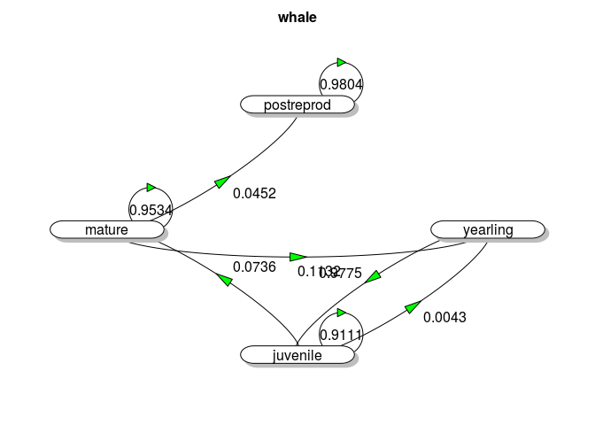

Poblaciones estructuradas
================
Mario Quevedo
March 7, 2019

#### Librerias necesarias

``` r
library (popbio)
library(diagram)
```

    ## Loading required package: shape

``` r
library(shape)
library(pander)
```

#### Población

*Aster pyrenaeus* Desf.ex DC.

La especie que se va a estudiar es un endemismo pirenaico-cantábrico, sólo posee 3 poblaciones en España y todas se encuentran en el Parque Nacional de Picos de Europa (Bulnes, valle del Dueje y Tresviso). Es una planta que posee las yemas radicales a nivel de superficie, flores hermafroditas y femeninas en el mismo capítulo (ginomonoico) y fecundación preferentemente alógama. Forma parte de pastizales vivaces de orlas forestales, sobre sustratos ricos en bases.

El modelo plantea una población estructurada en tamaños: Durmientes , 1-2 tallos, 3 - 10 tallos, &gt;10 tallos.

``` r
aster_stg <- c ("Durmientes","1-2 tallos","3-10 tallos", ">10 tallos")
```

Vector de abuntancias en el tiempo 0

``` r
aster_n0 <- c (200,975,1175,175)
```

Insertamos la matriz promedio

``` r
aster_mean <- matrix(c(
  0.000, 0.141, 0.070, 0.111,
  0.510, 0.742, 0.307, 0.406,
  0.299, 0.204, 0.705, 0.489,
  0.025, 0.010, 0.071, 0.335
), nrow = 4, byrow = TRUE, dimnames = list(aster_stg, aster_stg))
```

Graficamos la matriz

``` r
image2 (aster_mean, border="gray70", col = (grey.colors(12, start = 1, end = 0.6, gamma = 2.2,alpha = NULL)), mar=c(2,5,5.5,1))
```

 En la presente matriz estructurada por estadios, se observa que en el caso de los individuos que poseen de 3-10 tallos contribuyen muy poco a la fertilidad (tienen una probabilidad de 0,07), contribuyen un poquito más aunque también en poco valor los individuos que poseen de 1-2 tallos y los que poseen más de 10 tallos ya que tienen unas probabilidades de 0,141 y 0,111 respectivamente.Estos resultados apoyan la teoría de Iriondo et al.(2009), ya que esta especie no se reproduce por semillas, no se encontraron evidencias de si tiene reporducción asexual. Por tanto la especie tiene crecimiento vegetativo a través de los tallos que emergen de su rizoma. En cuanto a la clase de individuos que poseen de 3-10 tallos, es en la que más posibilidades de permanencia en ese estadio existen, ya que tal y como se explicó anteriormente, esta especie crece vegetativamente a través de tallos.

Graficamos el ciclo de vida de la especie

``` r
oldpar <-par()
par(mar=c(0,0,2,0))
plotmat(aster_mean, relsize =0.8, self.cex = 0.5, self.shifty=0.051,
        box.prop = 0.2,box.type = "round" ,box.size = 0.11, lwd = 1, pos =, 
        arr.col = "green", arr.lcol = "black", arr.type = "triangle",
        main = "Aster pyreaeus")
```


``` r
par(oldpar)
```

Con este ciclo de vida, se muestra la representación gráfica de los resultados de la matriz estructurada en estadios explicada anteriormente.

Calculos deterministas

``` r
pander(eigen.analysis (aster_mean))
```

-   **lambda1**: *1.105*
-   **stable.stage**:

    <table style="width:75%;">
    <colgroup>
    <col width="18%" />
    <col width="18%" />
    <col width="19%" />
    <col width="19%" />
    </colgroup>
    <thead>
    <tr class="header">
    <th align="center">Durmientes</th>
    <th align="center">1-2 tallos</th>
    <th align="center">3-10 tallos</th>
    <th align="center">&gt;10 tallos</th>
    </tr>
    </thead>
    <tbody>
    <tr class="odd">
    <td align="center">0.09089</td>
    <td align="center">0.4925</td>
    <td align="center">0.3729</td>
    <td align="center">0.04375</td>
    </tr>
    </tbody>
    </table>

-   **sensitivities**:

    <table>
    <colgroup>
    <col width="25%" />
    <col width="18%" />
    <col width="18%" />
    <col width="19%" />
    <col width="19%" />
    </colgroup>
    <thead>
    <tr class="header">
    <th align="center"> </th>
    <th align="center">Durmientes</th>
    <th align="center">1-2 tallos</th>
    <th align="center">3-10 tallos</th>
    <th align="center">&gt;10 tallos</th>
    </tr>
    </thead>
    <tbody>
    <tr class="odd">
    <td align="center"><strong>Durmientes</strong></td>
    <td align="center">0.06929</td>
    <td align="center">0.3754</td>
    <td align="center">0.2843</td>
    <td align="center">0.03335</td>
    </tr>
    <tr class="even">
    <td align="center"><strong>1-2 tallos</strong></td>
    <td align="center">0.08606</td>
    <td align="center">0.4663</td>
    <td align="center">0.3531</td>
    <td align="center">0.04143</td>
    </tr>
    <tr class="odd">
    <td align="center"><strong>3-10 tallos</strong></td>
    <td align="center">0.09929</td>
    <td align="center">0.538</td>
    <td align="center">0.4074</td>
    <td align="center">0.0478</td>
    </tr>
    <tr class="even">
    <td align="center"><strong>&gt;10 tallos</strong></td>
    <td align="center">0.1185</td>
    <td align="center">0.6419</td>
    <td align="center">0.4861</td>
    <td align="center">0.05703</td>
    </tr>
    </tbody>
    </table>

-   **elasticities**:

    <table>
    <colgroup>
    <col width="25%" />
    <col width="18%" />
    <col width="18%" />
    <col width="19%" />
    <col width="19%" />
    </colgroup>
    <thead>
    <tr class="header">
    <th align="center"> </th>
    <th align="center">Durmientes</th>
    <th align="center">1-2 tallos</th>
    <th align="center">3-10 tallos</th>
    <th align="center">&gt;10 tallos</th>
    </tr>
    </thead>
    <tbody>
    <tr class="odd">
    <td align="center"><strong>Durmientes</strong></td>
    <td align="center">0</td>
    <td align="center">0.04792</td>
    <td align="center">0.01801</td>
    <td align="center">0.003351</td>
    </tr>
    <tr class="even">
    <td align="center"><strong>1-2 tallos</strong></td>
    <td align="center">0.03973</td>
    <td align="center">0.3132</td>
    <td align="center">0.09813</td>
    <td align="center">0.01523</td>
    </tr>
    <tr class="odd">
    <td align="center"><strong>3-10 tallos</strong></td>
    <td align="center">0.02687</td>
    <td align="center">0.09935</td>
    <td align="center">0.26</td>
    <td align="center">0.02116</td>
    </tr>
    <tr class="even">
    <td align="center"><strong>&gt;10 tallos</strong></td>
    <td align="center">0.002681</td>
    <td align="center">0.005811</td>
    <td align="center">0.03124</td>
    <td align="center">0.0173</td>
    </tr>
    </tbody>
    </table>

-   **repro.value**:

    <table style="width:75%;">
    <colgroup>
    <col width="18%" />
    <col width="18%" />
    <col width="19%" />
    <col width="19%" />
    </colgroup>
    <thead>
    <tr class="header">
    <th align="center">Durmientes</th>
    <th align="center">1-2 tallos</th>
    <th align="center">3-10 tallos</th>
    <th align="center">&gt;10 tallos</th>
    </tr>
    </thead>
    <tbody>
    <tr class="odd">
    <td align="center">1</td>
    <td align="center">1.242</td>
    <td align="center">1.433</td>
    <td align="center">1.71</td>
    </tr>
    </tbody>
    </table>

-   **damping.ratio**: *2.179*

<!-- end of list -->
``` r
pander(generation.time (aster_mean))
```

*-Inf* Gracias a los análisis deterministas realizados, se puede concluir que un 9% de la especie se encuentra en estado durmiente; un 49% es plántula joven, es decir, que forma de 1-2 tallos; un 37% de los individuos forman de 3-10 tallos y un 43% forman más de 10 tallos. Esto respalda los datos aportados por Iriondo et al. (2009)ya que como se ha dicho con anterioridad, Aster pyrenaeus es una especie que crece vegetativamente a través de tallos, por lo que es lógico que la mayor proporción se encuentre en el estadio con más tallos, favoreciendo su proliferación.

Analizando la tasa finita de crecimiento (lambda), se observa que presenta un valor mayor que 1 salvo en una parcela estudiada, es decir, que presenta una tasa de crecimiento positiva lo cual concuerda con Iriondo et al. (2009) que afirma que esta especie presenta una tendencia estable de crecimiento.

El valor reproductivo muestra que las clases que más contribuyen a la proliferción de la especie son, como ya se ha observado, las clases con individuos con más tallos, maximizando el valor reproductivo actual.

En cuanto a la elasticidad, el estadio de individuos que tienen de 3-10 tallos posee el valor más alto de sensibilidad. Esto indica que se debería actuar sobre estos individuos ya que son los que más peso aportan y así se podría evitar el declive que pudieran llegar a sufrir.

Tiempo de residencia, esperanza de vida

``` r
pander(fundamental.matrix (aster_mean))
```

-   **N**:

    <table>
    <colgroup>
    <col width="25%" />
    <col width="18%" />
    <col width="18%" />
    <col width="19%" />
    <col width="19%" />
    </colgroup>
    <thead>
    <tr class="header">
    <th align="center"> </th>
    <th align="center">Durmientes</th>
    <th align="center">1-2 tallos</th>
    <th align="center">3-10 tallos</th>
    <th align="center">&gt;10 tallos</th>
    </tr>
    </thead>
    <tbody>
    <tr class="odd">
    <td align="center"><strong>Durmientes</strong></td>
    <td align="center">1</td>
    <td align="center">0</td>
    <td align="center">0</td>
    <td align="center">0</td>
    </tr>
    <tr class="even">
    <td align="center"><strong>1-2 tallos</strong></td>
    <td align="center">-18.52</td>
    <td align="center">-18.84</td>
    <td align="center">-27.18</td>
    <td align="center">-31.49</td>
    </tr>
    <tr class="odd">
    <td align="center"><strong>3-10 tallos</strong></td>
    <td align="center">-14.82</td>
    <td align="center">-16.4</td>
    <td align="center">-19.54</td>
    <td align="center">-24.38</td>
    </tr>
    <tr class="even">
    <td align="center"><strong>&gt;10 tallos</strong></td>
    <td align="center">-1.823</td>
    <td align="center">-2.034</td>
    <td align="center">-2.495</td>
    <td align="center">-1.573</td>
    </tr>
    </tbody>
    </table>

-   **var**:

    <table>
    <colgroup>
    <col width="25%" />
    <col width="18%" />
    <col width="18%" />
    <col width="19%" />
    <col width="19%" />
    </colgroup>
    <thead>
    <tr class="header">
    <th align="center"> </th>
    <th align="center">Durmientes</th>
    <th align="center">1-2 tallos</th>
    <th align="center">3-10 tallos</th>
    <th align="center">&gt;10 tallos</th>
    </tr>
    </thead>
    <tbody>
    <tr class="odd">
    <td align="center"><strong>Durmientes</strong></td>
    <td align="center">0</td>
    <td align="center">0</td>
    <td align="center">0</td>
    <td align="center">0</td>
    </tr>
    <tr class="even">
    <td align="center"><strong>1-2 tallos</strong></td>
    <td align="center">373.2</td>
    <td align="center">373.7</td>
    <td align="center">312.4</td>
    <td align="center">226.3</td>
    </tr>
    <tr class="odd">
    <td align="center"><strong>3-10 tallos</strong></td>
    <td align="center">374.4</td>
    <td align="center">388.4</td>
    <td align="center">401.5</td>
    <td align="center">382.9</td>
    </tr>
    <tr class="even">
    <td align="center"><strong>&gt;10 tallos</strong></td>
    <td align="center">4.234</td>
    <td align="center">4.295</td>
    <td align="center">4.119</td>
    <td align="center">4.047</td>
    </tr>
    </tbody>
    </table>

-   **cv**:

    <table>
    <colgroup>
    <col width="25%" />
    <col width="18%" />
    <col width="18%" />
    <col width="19%" />
    <col width="19%" />
    </colgroup>
    <thead>
    <tr class="header">
    <th align="center"> </th>
    <th align="center">Durmientes</th>
    <th align="center">1-2 tallos</th>
    <th align="center">3-10 tallos</th>
    <th align="center">&gt;10 tallos</th>
    </tr>
    </thead>
    <tbody>
    <tr class="odd">
    <td align="center"><strong>Durmientes</strong></td>
    <td align="center">0</td>
    <td align="center">NA</td>
    <td align="center">NA</td>
    <td align="center">NA</td>
    </tr>
    <tr class="even">
    <td align="center"><strong>1-2 tallos</strong></td>
    <td align="center">-1.043</td>
    <td align="center">-1.026</td>
    <td align="center">-0.6502</td>
    <td align="center">-0.4777</td>
    </tr>
    <tr class="odd">
    <td align="center"><strong>3-10 tallos</strong></td>
    <td align="center">-1.306</td>
    <td align="center">-1.202</td>
    <td align="center">-1.025</td>
    <td align="center">-0.8026</td>
    </tr>
    <tr class="even">
    <td align="center"><strong>&gt;10 tallos</strong></td>
    <td align="center">-1.129</td>
    <td align="center">-1.019</td>
    <td align="center">-0.8133</td>
    <td align="center">-1.279</td>
    </tr>
    </tbody>
    </table>

-   **meaneta**:

    <table style="width:75%;">
    <colgroup>
    <col width="18%" />
    <col width="18%" />
    <col width="19%" />
    <col width="19%" />
    </colgroup>
    <thead>
    <tr class="header">
    <th align="center">Durmientes</th>
    <th align="center">1-2 tallos</th>
    <th align="center">3-10 tallos</th>
    <th align="center">&gt;10 tallos</th>
    </tr>
    </thead>
    <tbody>
    <tr class="odd">
    <td align="center">-34.16</td>
    <td align="center">-37.27</td>
    <td align="center">-49.22</td>
    <td align="center">-57.44</td>
    </tr>
    </tbody>
    </table>

-   **vareta**:

    <table style="width:75%;">
    <colgroup>
    <col width="18%" />
    <col width="18%" />
    <col width="19%" />
    <col width="19%" />
    </colgroup>
    <thead>
    <tr class="header">
    <th align="center">Durmientes</th>
    <th align="center">1-2 tallos</th>
    <th align="center">3-10 tallos</th>
    <th align="center">&gt;10 tallos</th>
    </tr>
    </thead>
    <tbody>
    <tr class="odd">
    <td align="center">1847</td>
    <td align="center">1900</td>
    <td align="center">1863</td>
    <td align="center">1686</td>
    </tr>
    </tbody>
    </table>

<!-- end of list -->
``` r
Esp4=fundamental.matrix (aster_mean)
mean(Esp4$meaneta)
```

    ## [1] -44.52227

La **media de esperanza de vida** para todas la clases de individuos sería de

Proyección determinista por iteraciones de N(t+1) = L N(t)

``` r
aster_nt <- pop.projection (aster_mean, aster_n0, 25)
```

A partir de la proyeción determinista previa, gráfico de convergencia a distribución estable de estadios a partir de santolina\_n0

``` r
par(mfrow=c(1,2))
stage.vector.plot (aster_nt$stage.vectors, col=rainbow(4, start = 3/6, end = 5/6),
                   ylim = c(0,0.8))

par(oldpar)
```


**Estocasticidad**: Cargamos las matrices anuales que nos permiten analizar el efecto de estocasticidad ambiental

``` r
aster_20012002 <- matrix(c(
  0.000, 0.094, 0.053, 0.056,
  0.538, 0.797, 0.288, 0.451,
  0.385, 0.151, 0.707, 0.444,
  0.077, 0.000, 0.067, 0.389
), nrow = 4, byrow = TRUE, dimnames = list(aster_stg, aster_stg))

aster_20022003 <- matrix(c(
  0.000, 0.136, 0.092, 0.000,
  0.091, 0.704, 0.202, 0.228,
  0.076, 0.197, 0.789, 0.929,
  0.000, 0.000, 0.013, 0.071
), nrow = 4, byrow = TRUE, dimnames = list(aster_stg,aster_stg))

aster_20032004 <- matrix(c(
  0.000, 0.226, 0.084, 0.500,
  0.643, 0.730, 0.222, 0.653,
  0.357, 0.258, 0.627, 0.000,
  0.000, 0.032, 0.169, 0.500
), nrow = 4, byrow = TRUE, dimnames = list(aster_stg, aster_stg))

aster_20042005 <- matrix(c(
  0.000, 0.105, 0.052, 0.000,
  0.476, 0.795, 0.545, 0.283,
  0.476, 0.211, 0.701, 0.529,
  0.048, 0.018, 0.039, 0.353
), nrow = 4, byrow = TRUE, dimnames = list(aster_stg, aster_stg))

aster_20052006 <- matrix(c(
  0.000, 0.145, 0.069, 0.000,
  0.800, 0.683, 0.280, 0.414,
  0.200, 0.203, 0.701, 0.545,
  0.000, 0.000, 0.069, 0.364
), nrow = 4, byrow = TRUE, dimnames = list(aster_stg, aster_stg))
```

Promedio de p(quasi-extinción) a 25 años

``` r
mean(aster_sqe[25,])
```

    ## [1] 0

``` r
matplot (aster_sqe, xlab="Years", ylab=expression(P[q-ext]), 
         type='l', lty=1, las=1)
```


