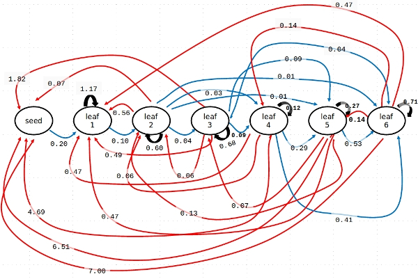

```{r setup, include=FALSE}
knitr::opts_chunk$set(echo = TRUE)
options(warn=-1)
```

#### Librerías utilizadas
```{r message=FALSE, warning=FALSE}
library (popbio)
library(pander)
```

#### Introduciendo matrices y estadios
En el ejemplo anterior de poblaciones estructuradas (ctrl. + clic https://github.com/quevedomario/eco3r/blob/master/stages.md), los datos del modelo para las orcas estaban incluidos en la librería **popbio**. Para introducir nuestro propio modelo hay que usar sintaxis de **R** para matrices. A continuación un ejemplo con los datos de la herbácea de ciclo complejo  *Arisaema triphyllum*:

Hay que definir los estadios o clases. El formato es un simple vector de texto, construido con `c("estadios entre comillas", "separados por comas")`:

```{r}
stages_arisaema <- c("seeds",	"size1",	"size2",	"size3",	
                     "size4", "size5",	"size6")
```

En este caso el modelo está basado en un primer estadio *semillas* y 6 clases de tamaño. 

A continuación introducimos los datos de la matriz de transición, que incluirá 7 filas y columnas ya que el modelo tiene 7 estadios. Los números los introducimos separados por comas en un simple vector numérico `c()`, en el que la matriz se lee de izquierda a derecha, y de arriba a abajo (espacios y saltos de línea no afectan la funcionalidad del código):

```{r}
arisaema <- c(
  0.00,0.00,0.00,0.25,0.82,4.51,5.99,
  0.30,0.58,0.30,0.06,0.06,0.10,0.06,
  0.00,0.20,0.59,0.19,0.02,0.05,0.09,
  0.00,0.00,0.08,0.47,0.12,0.05,0.00,
  0.00,0.00,0.02,0.23,0.38,0.22,0.09,
  0.00,0.00,0.00,0.05,0.40,0.34,0.43,
  0.00,0.00,0.00,0.00,0.02,0.25,0.34
)
```

Finalmente construimos la matriz con la función `matrix2()` que combina y coloca  transiciones y estadios; vemos el resultado simplemente invocando **arisaema_matrix**: 

```{r}
arisaema_matrix <- matrix2(arisaema, stages_arisaema)
arisaema_matrix
```

A diferencia de la gran mayoría de animales, en modelos de plantas estructurados en tamaños muchas transiciones son posibles; tanto creciendo y "saltándose" estadios (e.g. `arisaema_matrix[5,4]`) como retrocediendo a estadios anteriores (e.g. `arisaema_matrix[2,7]`). Además, puede existir reproducción vegetativa, con lo que algunas transiciones pueden ser > 1. Las transiciones recogidas en **arisaema_matrix** equivalen al ciclo:



#### Tasa de crecimiento y estructura estable de estadios
```{r}
lambda(arisaema_matrix)
stable.stage(arisaema_matrix)
```

La combinación de fecundidad y supervivencia de los distintos estadios se traduce en una dinámica estable (lambda = 1.002), y en una población mayoritariamente compuesta por semillas e individuos en los estadios de tamaño 1 y 2; aproximadamente un 11% estarán en los tamaños 3 a 5.

#### Proyección de la población de N~0~ a N~25~
Tras definir un vector de abundancias iniciales N~0~, lo proyectamos de t~0~ a t~25~ con la función `pop.projection()`: 
```{r}
n0_arisaema <- c(29,37,21,4,4,3,2)
arisaema_nt <- pop.projection (arisaema_matrix, n0_arisaema, 25)
```

Podemos pintar algunos de los resultados de la proyección, contenidos^1^ en **arisaema_nt**. A continuación, los cambios en el tiempo en el tamaño de la población:
```{r}
plot(arisaema_nt$pop.sizes, ylim=c(90, 110), xlab = "año", ylab="Nt")
```

`stage.vector.plot` usa otra parte de los resultados de **arisaema_nt** para dibujar la trayectoria de las proporciones de los estadios entre t~0~ y t~25~: 
```{r}
stage.vector.plot (arisaema_nt$stage.vectors, ylim = c(0, 0.7))
```

¿Por qué no varían las proporciones de los distintos estadios?

#### Enlaces, referencias, anotaciones de código
Para abrir los enlaces en otra pestaña, *botón derecho + abrir en nueva pestaña*, o *Ctrl. + clic*

1. **arisaema_nt** contiene varios resultados. El código que pinta la trayectoria del tamaño de la población `plot(arisaema_nt$pop.sizes, ylim=c(90, 110), xlab = "año")` usa la forma habitual en **R** de referirse a distintas partes de objetos en memoria. El símbolo **$** identifica un apartado de **arisaema_nt**, concretamente los resultados del tamaño de la población **pop.sizes**. Para comprobar el contenido y estructura de un objeto en R, podemos usar `str(arisaema_nt)`.  