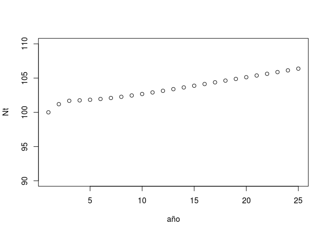

Modelos de poblaciones estructuradas. Análisis determinista 2
================
Abril de 2019

#### Librerías utilizadas

``` r
library (popbio)
library(pander)
```

#### Introduciendo matrices y estadios

En el ejemplo anterior de poblaciones estructuradas (ctrl. + click <https://github.com/quevedomario/eco3r/blob/master/stages.md>), los datos del modelo para las orcas estaban incluidos en la librería **popbio**. Para introducir nuestro propio modelo hay que usar sintaxis de **R** para matrices. A continuación un ejemplo con los datos de la herbácea de ciclo complejo *Arisaema triphyllum*:

Hay que definir los estadios o clases. El formato es un simple vector de texto, construido con `c("estadios entre comillas", "separados por comas")`:

``` r
stages_arisaema <- c("seeds",   "size1",    "size2",    "size3",    
                     "size4", "size5",  "size6")
```

En este caso el modelo está basado en un primer estadio *semillas* y 6 clases de tamaño. A continuación introducimos los datos de la matriz de transición. El modelo tiene 7 estadios, por tanto la matriz incluye 7 filas y 7 columnas. Los números los introducimos separados por comas en un simple vector numérico `c()`, en el que la matriz se lee de izquierda a derecha, y de arriba a abajo. Espacios y saltos de línea no afectan la funcionalidad del código:

``` r
arisaema <- c(
  0.00,0.00,0.00,0.25,0.82,4.51,5.99,
  0.30,0.58,0.30,0.06,0.06,0.10,0.06,
  0.00,0.20,0.59,0.19,0.02,0.05,0.09,
  0.00,0.00,0.08,0.47,0.12,0.05,0.00,
  0.00,0.00,0.02,0.23,0.38,0.22,0.09,
  0.00,0.00,0.00,0.05,0.40,0.34,0.43,
  0.00,0.00,0.00,0.00,0.02,0.25,0.34
)
```

Y finalmente construimos la matriz con la función `matrix2()` que combina estadios y transiciones, y vemos el resultado:

``` r
arisaema_matriz <- matrix2(arisaema, stages_arisaema)
pander(arisaema_matriz)
```

<table style="width:94%;">
<colgroup>
<col width="16%" />
<col width="11%" />
<col width="11%" />
<col width="11%" />
<col width="11%" />
<col width="11%" />
<col width="11%" />
<col width="11%" />
</colgroup>
<thead>
<tr class="header">
<th align="center"> </th>
<th align="center">seeds</th>
<th align="center">size1</th>
<th align="center">size2</th>
<th align="center">size3</th>
<th align="center">size4</th>
<th align="center">size5</th>
<th align="center">size6</th>
</tr>
</thead>
<tbody>
<tr class="odd">
<td align="center"><strong>seeds</strong></td>
<td align="center">0</td>
<td align="center">0</td>
<td align="center">0</td>
<td align="center">0.25</td>
<td align="center">0.82</td>
<td align="center">4.51</td>
<td align="center">5.99</td>
</tr>
<tr class="even">
<td align="center"><strong>size1</strong></td>
<td align="center">0.3</td>
<td align="center">0.58</td>
<td align="center">0.3</td>
<td align="center">0.06</td>
<td align="center">0.06</td>
<td align="center">0.1</td>
<td align="center">0.06</td>
</tr>
<tr class="odd">
<td align="center"><strong>size2</strong></td>
<td align="center">0</td>
<td align="center">0.2</td>
<td align="center">0.59</td>
<td align="center">0.19</td>
<td align="center">0.02</td>
<td align="center">0.05</td>
<td align="center">0.09</td>
</tr>
<tr class="even">
<td align="center"><strong>size3</strong></td>
<td align="center">0</td>
<td align="center">0</td>
<td align="center">0.08</td>
<td align="center">0.47</td>
<td align="center">0.12</td>
<td align="center">0.05</td>
<td align="center">0</td>
</tr>
<tr class="odd">
<td align="center"><strong>size4</strong></td>
<td align="center">0</td>
<td align="center">0</td>
<td align="center">0.02</td>
<td align="center">0.23</td>
<td align="center">0.38</td>
<td align="center">0.22</td>
<td align="center">0.09</td>
</tr>
<tr class="even">
<td align="center"><strong>size5</strong></td>
<td align="center">0</td>
<td align="center">0</td>
<td align="center">0</td>
<td align="center">0.05</td>
<td align="center">0.4</td>
<td align="center">0.34</td>
<td align="center">0.43</td>
</tr>
<tr class="odd">
<td align="center"><strong>size6</strong></td>
<td align="center">0</td>
<td align="center">0</td>
<td align="center">0</td>
<td align="center">0</td>
<td align="center">0.02</td>
<td align="center">0.25</td>
<td align="center">0.34</td>
</tr>
</tbody>
</table>

A diferencia de lo que ocurre con la gran mayoria de animales, en modelos de plantas estructurados en tamaños muchas transiciones son posibles, tanto creciendo "saltándose" estadios (e.g. `arisaema_matriz[5,4]`) como retrocediendo a estadios anteriores (e.g. `arisaema_matriz[2,7]`). Además, puede existir reproducción vegetativa, con lo que algunas transiciones pueden ser &gt; 1. Los modelos matriciales permiten estudiar numéricamente ciclos complejos, como este de *Arisaema triphyllum*:
 \#\#\#\# Tasa de crecimiento y estructura estable de estadios

``` r
lambda(arisaema_matriz)
```

    ## [1] 1.002367

``` r
pander(stable.stage(arisaema_matriz))
```

<table style="width:92%;">
<colgroup>
<col width="12%" />
<col width="11%" />
<col width="12%" />
<col width="13%" />
<col width="13%" />
<col width="13%" />
<col width="13%" />
</colgroup>
<thead>
<tr class="header">
<th align="center">seeds</th>
<th align="center">size1</th>
<th align="center">size2</th>
<th align="center">size3</th>
<th align="center">size4</th>
<th align="center">size5</th>
<th align="center">size6</th>
</tr>
</thead>
<tbody>
<tr class="odd">
<td align="center">0.2853</td>
<td align="center">0.374</td>
<td align="center">0.2106</td>
<td align="center">0.04335</td>
<td align="center">0.03728</td>
<td align="center">0.03512</td>
<td align="center">0.01438</td>
</tr>
</tbody>
</table>

#### Proyección de la población de N<sub>0</sub> a N<sub>25</sub>

``` r
n0_arisaema <- c(10,10,10,10,10,10,10)
arisaema_nt <- pop.projection (arisaema_matriz, n0_arisaema, 25)
```

`stage.vector.plot` usa los resultados de **arisaema\_nt** para dibujar el cambio de las proporciones de los estadios entre t<sub>0</sub> y t<sub>25</sub>:

``` r
stage.vector.plot (arisaema_nt$stage.vectors, ylim = c(0, 0.65))
```


