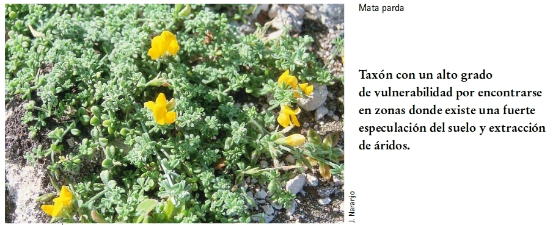
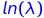
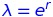

Para este ejercicio son necesarias las librerías **popbio** y **diagram**
```{r message=FALSE, warning=FALSE}
library(diagram)
library (popbio) 
```

### Análisis de viabilidad para una población de *Lotus arinagensis*


La imagen es una captura de pantalla de la información recogida en el Atlas y Libro Rojo de la Flora Vascular Amenazada de España, [disponible en pdf; Ctrl click para abrir en otra pestaña](https://www.miteco.gob.es/es/biodiversidad/temas/inventarios-nacionales/829_tcm30-99330.pdf). 

El ejercicio practica la inclusión de la variabilidad ambiental no predecible, *estocasticidad ambiental*, en los modelos de poblaciones estructuradas vistos anteriormente en https://github.com/quevedomario/eco3r/blob/master/stages.md y en https://github.com/quevedomario/eco3r/blob/master/stages2.md  

El modelo está estructurado en 4 estadios, plántulas y 3 clases de reproductores. Introducimos el vector de estadios, al que llamo arbitrariamente `lotus_stages`; podría llamarse `molly`, pero quizás tendríamos problemas para recordarlo después: 
```{r}
lotus_stages <- c ("plántula", "repro1", "repro2", "repro3")
```

Definimos además dos vectores alternativos de abundancias en t = 0, *N~0~*; uno con el mismo número de individuos por estadio, y otro con mayoría del estadio *repro3*:
```{r}
lotus_n0 <- c (100,100,100,100)
lotus_n0_alt <- c(10,10,10,370)
```

Introducimos las probabilidades de transición^1^:
```{r}
lotus_trans <- c(
  0.000, 0.165, 0.711, 2.215, 
  0.000, 0.000, 0.000, 0.000, 
  0.000, 0.013, 0.013, 0.002,
  0.182, 0.286, 0.436, 0.624
) 
```

Y construimos la matriz de transición combinando estadios y transiciones:
```{r}
lotus_matrix <- matrix2(lotus_trans, lotus_stages)
```

Una vez definido el modelo de la población, podemos empezar a extraerle información. Por ejemplo, dibujando el ciclo de vida de *L. arinagensis* con la función `plotmat()`. Puede pareer complicada porque presenta muchos ajustes posibles (e.g. muchos *argumentos*), que determinarán el aspecto final del gráfico:
```{r}
plotmat(lotus_matrix, relsize =.86, self.cex = 0.5, self.shifty=0.051,
        box.prop = 0.3, box.type = "round" ,box.size = 0.1, lwd = 1, pos =, 
        arr.col = "blue", arr.lcol = "black", arr.type = "triangle",
        main = "")
```

Podemos obtener explicación de cómo trabajan esos argumentos con `?plotmat`.

El ciclo de vida facilita la interpretación visual de las transiciones observadas en la población, y de las diferencias dentro de la misma: algunos individuos permanecen en el mismo estadio entre t y t + 1; otros regresan a estadios anteriores; y otros se "saltan" estadios en el crecimiento. Esas peculiaridades, especialmente habituales en organismos modulares con modelos basados en tamaño o estadio reproductor, se modelan eficientemente con estas matrices.   

Los cálculos deterministas se extraerían de manera análoga a la vista en ejercicios anteriores (https://github.com/quevedomario/eco3r/blob/master/stages.md y https://github.com/quevedomario/eco3r/blob/master/stages2.md), desde los cuales es fácil adaptar el código.

Por ahora con obtener lambda es suficiente, para compararla con los resultados que incorporen estocasticidad más adelante:
```{r}
lambda (lotus_matrix)
```

Para incorporar estocasticidad ambiental una posibilidad es contar con información sobre la variación de las tasas vitales de la matriz de transición. En este caso disponemos de datos de tres temporadas de campo, tres matrices anuales^1^. La matriz de transición anterior, **lotus_matrix**, es una matriz promedio de las siguientes:

```{r}
lotus_20022003 <- matrix(c(
  0.000, 0.496, 0.972, 1.743,
  0.000, 0.000, 0.000, 0.000,
  0.000, 0.006, 0.000, 0.000,
  0.379, 0.480, 0.540, 0.602
), nrow = 4, byrow = TRUE, dimnames = list(lotus_stages, lotus_stages))

lotus_20032004 <- matrix(c(
  0.000, 0.000, 0.076, 1.002,
  0.000, 0.000, 0.000, 0.000,
  0.000, 0.000, 0.023, 0.006,
  0.167, 0.120, 0.349, 0.569
), nrow = 4, byrow = TRUE, dimnames = list(lotus_stages, lotus_stages))

lotus_20042005 <- matrix(c(
  0.000, 0.000, 1.086, 3.900,
  0.000, 0.000, 0.000, 0.000,
  0.000, 0.032, 0.016, 0.000,
  0.000, 0.258, 0.419, 0.701
), nrow = 4, byrow = TRUE, dimnames = list(lotus_stages, lotus_stages))
```

Una vez introducidas en la memoria de la sesión de R, combinamos las tres matrices en una lista, formato requerido por la librería `popbio()` para realizar algunos cálculos:
```{r}
lotus_lista <- list(lotus_20022003, lotus_20032004, lotus_20042005)
```

### Proyección estocástica
A continuación podemos simular el crecimiento bajo influencia de estocásticidad ambiental, con la función `stoch.projection()`. Esta requiere 2 o más matrices de proyección (tenemos 3); es decir, requiere tener información sobre la variación en las tasas vitales. 

El resultado de la *proyección estocástica* lo almacenamos en un objeto **lotus_stoch_proj**. Los argumentos de la función son el tiempo de proyección `tmax=` y el número de repeticiones `nreps=`:
```{r}
set.seed(12345)
lotus_stoch_proj <- stoch.projection (lotus_lista, lotus_n0, tmax=25, nreps=1000)
tail (lotus_stoch_proj)
```

La función `tail()`anterior muestra las 6 últimas de las 1000 (`nreps=1000`) proyecciones estocásticas de nuestro conjunto de matrices de *Lotus arinagensis*. Nos muestra el tamaño de cada estadio a los 25 años (`tmax=25`), sometido a variación ambiental. Las fluctuaciones son consecuencia de los distintos valores de las transiciones obtenidos en las tres temporadas de campo, y recogidos en las matrices **lotus_20022003**, **lotus_20032004** y **lotus_20042005**. Por ejemplo, el elemento `[4,1]` de las matrices indica la probabilidad de transición del estadio *plántula* a *repro3* entre t y t+1, y oscila entre 0 y 0.379. Y en el resultado la abundancia del estadio *plántula* oscila entre 113.7 (repetición 998) y 885.3 (repetición 997) en las 6 últimas repeticiones de la proyección.

La función `set.seed(12345)` es responsable de que todos obtengamos el mismo resultado a partir dde este guión, a pesar de "jugar" con números aleatorios. Le dice al generador de números aleatorios por donde empezar a generar. Es decir, proporciona un código repetible. De no definirlo onbtendríamos un resultado diferente para cada proyección, si bien resultado general será esencialmente el mismo si el número de repeticiones `nreps=` es suficientemente grande.

### Tasa estocástica de crecimiento 
Nos podemos preguntar cómo afecta la estocasticidad ambiental a la tasa asintótica de crecimiento, lambda. El valor determinista de la misma obtenido con `lambda (lotus_matrix)` era 1.02. La librería **popbio** calcula la tasa de crecimiento estocástico usando la función `stoch.growth.rate()`, y devuelve dos aproximaciones: 

- *Analítica*, basada en los elementos de esas matrices. Esta se llama *aproximación analítica de Tuljapurkar*. 
- *Simulada*, utilizando en cada repetición una de las 3 matrices disponibles en **lotus_lista**. 

Aparecen identificadas como `$aprox` y `$sim` en los resultados:
```{r}
set.seed(12345)
(lotus_stoch_r <- stoch.growth.rate (lotus_lista, prob = NULL, maxt = 50 ))
```

Esos valores próximos a 0 corresponden en realidad a la tasa intrínseca de crecimiento *r*, o a ; para obtener lambda tenemos que usar . `exp()` es la función que devuelve el resultado de e^x^:

```{r}
(lotus_lambda_sim <- exp(lotus_stoch_r$sim))
(lotus_lambda_anal <- exp(lotus_stoch_r$approx))
```

`$sim.CI` en el resultado de la tasa estocástica de crecimiento muestra el intervalo de confianza para la *r* estocástica simulada (la analítica es un valor único derivado de la matriz), en este caso incluyendo 0 en el centro de la distribución de valores; indica una población con una lambda estocástica esencialmente igual a 1.

### Elasticidades
En el ejercicio previo [de análisis exclusivamente determinista](https://github.com/quevedomario/eco3r/blob/master/stages.md) veíamos que la salida de `eigen.analysis()` incluía sensibilidades y elasticidades. La **elasticidad** de un elemento de la matriz de transición es el cambio proporcional en lambda que resulta de un cambio en ese elemento de la matriz. Las elasticidades indican *a priori* qué elementos de la matriz son **más determinantes para la dinámica de la población**.

La obtenemos con la función `stoch.sens()`:
```{r}
set.seed(12345)
stoch.sens(lotus_lista)
```

La tasa de crecimiento asintótica lambda = 1 indica una población con dinámica estable, si las tasas vitales de la matriz se mantienen. Sin embargo un análisis de viabilidad debe ofrecer un resultado más concreto: probabilidad de extinción en un tiempo determinado. Ese cálculo lo podemos ofrecer a partir de la función `stoch.quai.ext`. En realidad calcula la probabilidad de cuasi-extinción, o probabilidad de que la abundancia de la población baje de un determinado umbral:

```{r}
set.seed(12345)
lotus_sqe <- stoch.quasi.ext (lotus_lista, lotus_n0, tmax=25, Nx=50, maxruns = 10, nreps=1000)
tail(lotus_sqe)
```

El código implica 10 ejecuciones `maxruns=` separadas de la estima de probabilidad de cuasi-extinción, cada una con `nreps=` 1000 estimas de crecimiento de la población, ante un umbral de `Nx=` 50 individuos y un tiempo de `tmax=`25 años. `tail(lotus_sqe)` muestra las seis últimas filas, años en este caso, del resultado `lotus_sqe`. Fijándonos en el año 25, podemos resumir la probabilidad media de cuasi-extinción proyectada a 25 años: 
```{r}
mean(lotus_sqe[25,]); sd(lotus_sqe[25,])
```

Es decir, pedimos la media y desviación estándar de la probabilidad de que N~t~ < N~x~ en el año 25 de las 10 ejecuciones. A pesar de que la tasa asintótica determinista era 1.02, en presencia de variabilidad ambiental tenemos una probabilidad superior al 10% de que la población disminuya por debajo de 50 individuos en 25 años.

Para terminar, usamos aquello de que una imagen vale más que mil palabras, también en el contexto de análisis de viabilidad de poblaciones:
```{r}
matplot (lotus_sqe, xlab="Años", ylab=expression(P[q-ext]), 
         type='l', lty=1, las=1)
```


### Enlaces, referencias, anotaciones de código
Para abrir los enlaces en otra pestaña, *botón derecho + abrir en nueva pestaña*, o *Ctrl click*)  
1. Datos incluidos en Iriondo et al. (Eds). 2009. [Poblaciones en peligro: viabilidad demográfica de la flora vascular amenazada de España. Madrid: Ministerio de Medio Ambiente, y Medio Rural y Marino](https://www.miteco.gob.es/es/biodiversidad/temas/inventarios-nacionales/viabilidaddemografica_tcm30-99752.pdf)
  
