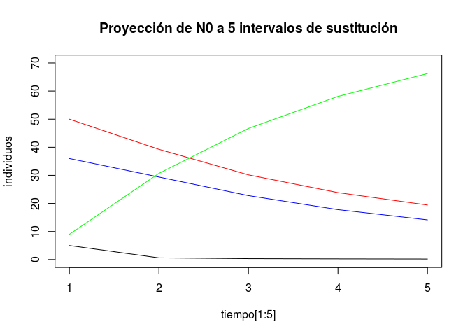

Sucesión ecológica - modelos cuantitativos con R
================
Abril 2019


#### Configuración previa

El ejercicio requiere escasa preparación previa. Usamos las librerías **popbio** para manipular las probabilidades de sustitución, y **pander** para mejorar formatos de salida:

``` r
library(popbio)
library(pander)
```

### Los datos

El modelo cuantitativo siguiente es un ejemplo clásico de sucesión secundaria forestal<sup>1</sup> <sup>y</sup> <sup>2</sup> con cuatro especies arbóreas norteamericanas: *Betula populifolia* (GB en la imagen), *Nyssa sylvatica* (BG), *Acer rubrum* (RM) y *Fagus grandifolia* (BE).


La matriz contiene las probabilidades (en columnas) de que cada individuo sea sustituido por otro de la misma u otra especie en un intervalo de tiempo (50 años en el trabajo original de Horn). Así la probabilidad de que *Betula* GB sea sustituido por *Nyssa* BG es 0.36, mientras que la probabilidad de que \* Acer\* RM sea sustituido por *Fagus* BE es 0.31.

Para construir la matriz definimos primero los **nombres** de las especies almacenándolos en un vector de texto con `c()`. A continuación almacenamos las **probabilidades** de sustitución en otro vector, numérico en este caso (i.e. valores sin comillas). Por último, combinamos ambos objetos en la **matriz** de proyección con `matrix2()`:

``` r
nombres <- c("Betula","Nyssa","Acer","Fagus") 

probabilidades <- c(
  0.05, 0.01,   0.00,   0.00,
  0.36, 0.57,   0.14,   0.01,
  0.50, 0.25,   0.55,   0.03,
  0.09, 0.17,   0.31,   0.96
  )

matriz <- matrix2(probabilidades, nombres)
pander(matriz)
```

<table style="width:61%;">
<colgroup>
<col width="18%" />
<col width="12%" />
<col width="11%" />
<col width="9%" />
<col width="9%" />
</colgroup>
<thead>
<tr class="header">
<th align="center"> </th>
<th align="center">Betula</th>
<th align="center">Nyssa</th>
<th align="center">Acer</th>
<th align="center">Fagus</th>
</tr>
</thead>
<tbody>
<tr class="odd">
<td align="center"><strong>Betula</strong></td>
<td align="center">0.05</td>
<td align="center">0.01</td>
<td align="center">0</td>
<td align="center">0</td>
</tr>
<tr class="even">
<td align="center"><strong>Nyssa</strong></td>
<td align="center">0.36</td>
<td align="center">0.57</td>
<td align="center">0.14</td>
<td align="center">0.01</td>
</tr>
<tr class="odd">
<td align="center"><strong>Acer</strong></td>
<td align="center">0.5</td>
<td align="center">0.25</td>
<td align="center">0.55</td>
<td align="center">0.03</td>
</tr>
<tr class="even">
<td align="center"><strong>Fagus</strong></td>
<td align="center">0.09</td>
<td align="center">0.17</td>
<td align="center">0.31</td>
<td align="center">0.96</td>
</tr>
</tbody>
</table>

#### Proyecciones

Para saber las abundancias o proporciones de las distintas especies en el futuro, a partir de las probabilidades de sustitución, proyectamos los cambios del parche forestal asumiendo que la composición inicial **N<sub>0</sub>** son 100 abedules *Betula populifolia*. Definimos también un vector de intervalos de **tiempo**, de 1 a 30.

``` r
n0 <- c(100,0,0,0)
tiempo <- c(1:30)
```

Para almacenar los resultados de cada intervalo de sustitución, las **proyecciones**, construimos una matriz con 4 filas (especies) y 5 columnas (intervalos de tiempo), por el momento vacía. Usamos los nombres de las especies y los 5 primeros intervalos de tiempo para identificar filas `rownames()` y columnas `colnames()`:

``` r
proyecciones <- matrix(nrow = 4, ncol = 5)

colnames(proyecciones) <- tiempo[1:5]
rownames(proyecciones) <- nombres

pander(proyecciones)
```

<table style="width:53%;">
<colgroup>
<col width="18%" />
<col width="6%" />
<col width="6%" />
<col width="6%" />
<col width="6%" />
<col width="6%" />
</colgroup>
<thead>
<tr class="header">
<th align="center"> </th>
<th align="center">1</th>
<th align="center">2</th>
<th align="center">3</th>
<th align="center">4</th>
<th align="center">5</th>
</tr>
</thead>
<tbody>
<tr class="odd">
<td align="center"><strong>Betula</strong></td>
<td align="center">NA</td>
<td align="center">NA</td>
<td align="center">NA</td>
<td align="center">NA</td>
<td align="center">NA</td>
</tr>
<tr class="even">
<td align="center"><strong>Nyssa</strong></td>
<td align="center">NA</td>
<td align="center">NA</td>
<td align="center">NA</td>
<td align="center">NA</td>
<td align="center">NA</td>
</tr>
<tr class="odd">
<td align="center"><strong>Acer</strong></td>
<td align="center">NA</td>
<td align="center">NA</td>
<td align="center">NA</td>
<td align="center">NA</td>
<td align="center">NA</td>
</tr>
<tr class="even">
<td align="center"><strong>Fagus</strong></td>
<td align="center">NA</td>
<td align="center">NA</td>
<td align="center">NA</td>
<td align="center">NA</td>
<td align="center">NA</td>
</tr>
</tbody>
</table>

El código a continuación utiliza un bucle `for()` para proyectar la dinámica del modelo durante 5 intervalos de sustitución:

``` r
for (i in 1:5) {
  n0 <- matriz %*% n0
  proyecciones[,i] <- n0
  pander(proyecciones)
  Sys.sleep(1)
  }
```

El código se lee "*para cada intervalo de tiempo de 1 a 5, multiplica la matriz por N<sub>0</sub>, y guardalo en la columna i de proyecciones*"<sup>3</sup>. Mostrará en la consola **R** el estado de la matriz en cada intervalo vía `pander(proyecciones)`.

<table style="width:74%;">
<colgroup>
<col width="18%" />
<col width="6%" />
<col width="11%" />
<col width="12%" />
<col width="12%" />
<col width="12%" />
</colgroup>
<thead>
<tr class="header">
<th align="center"> </th>
<th align="center">1</th>
<th align="center">2</th>
<th align="center">3</th>
<th align="center">4</th>
<th align="center">5</th>
</tr>
</thead>
<tbody>
<tr class="odd">
<td align="center"><strong>Betula</strong></td>
<td align="center">5</td>
<td align="center">0.61</td>
<td align="center">0.3246</td>
<td align="center">0.2441</td>
<td align="center">0.1902</td>
</tr>
<tr class="even">
<td align="center"><strong>Nyssa</strong></td>
<td align="center">36</td>
<td align="center">29.41</td>
<td align="center">22.79</td>
<td align="center">17.8</td>
<td align="center">14.15</td>
</tr>
<tr class="odd">
<td align="center"><strong>Acer</strong></td>
<td align="center">50</td>
<td align="center">39.27</td>
<td align="center">30.18</td>
<td align="center">23.86</td>
<td align="center">19.44</td>
</tr>
<tr class="even">
<td align="center"><strong>Fagus</strong></td>
<td align="center">9</td>
<td align="center">30.71</td>
<td align="center">46.71</td>
<td align="center">58.1</td>
<td align="center">66.22</td>
</tr>
</tbody>
</table>

Usando los resultados almacenados en **proyecciones** podemos pintar el cambio de abundancia de las 4 especies entre t<sub>1</sub> y t<sub>5</sub>. En negro *Betula*, en azul *Nyssa*, en rojo *Acer*, y en verde *Fagus*:

``` r
plot(tiempo[1:5], proyecciones[1,], type="l", ylim=c(0,70), ylab = "individuos",
     main="Proyección de N0 a 5 intervalos de sustitución")
lines(tiempo[1:5], proyecciones[2,], col="blue")
lines(tiempo[1:5], proyecciones[3,], col="red")
lines(tiempo[1:5], proyecciones[4,], col="green")
```



La proyección de cada especie está almacenada en una fila de **proyecciones**. El código define un gráfico `plot()` con la primera curva, la de los *Betula*, y a continuación añade el resto de curvas a dicho gráfico con `lines()`.

Adaptando el código anterior es inmediato proyectar la sustitución de especies más tiempo, o incluir cambios en las probabilidades de sustitución. Si perturbaciones recurrentes incrementan un 35% la **probabilidad global de transición a arces** y **disminuyen la de las hayas** en la misma magnitud, ¿cuál es la proporción de arces y hayas tras 6 intervalos de sustitución?

#### Referencias y anotaciones de código

1.  Morin PJ. 2011. Community Ecology, 2nd Edition. Wiley. Tabla 13.2.
2.  Horn HS. 1975. Markovian properties of forest succession. En *Ecology and Evolution of Communities*; Cody ML, Diamond JM (eds.). Harvard University Press, Cambridge, MS.
3.  En cada repetición **n0** es sustituido por el resultado de multiplicar el anterior por la matriz, si bien el contenido queda guardado en **proyecciones**. Los bucles `for(){}` son útiles para repetir cálculos y almacenar los resultados sucesivos. Entre paréntesis llevan siempre la variable que identifica la secuencia de repeticiones; entre corchetes, el conjunto de comandos u operaciones en orden de ejecución. En el ejemplo `Sys.sleep()` introduce un retraso de un segundo para ver los resultados sucesivos en la consola. Para acelerar el código podemos prescindir de la visualización de resultados intermedios, y del retraso.
