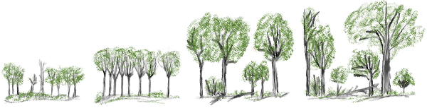

### Un modelo analítico de sucesión
Estos modelos son simplificaciones de los procesos reales, pero permiten fijarse en los aspectos básicos de la dinámica de sustitución de especies, y compararla entre distintas comunidades, o vías de sucesión. 

Planteamos un modelo matricial análogo al usado para modelar (ctrl. click) [dinámica de poblaciones estructuradas](https://github.com/quevedomario/eco3r/blob/master/stages.md) en clases de edad o estadios.
Ese modelo plantea en este caso de qué manera las comunidades cambian de estado a lo largo del tiempo. Esos estados los asumimos o construimos discretos, sin solapamiento.

El ejercicio requiere escasa preparación previa. Usamos las librerías **popbio** para procesar las probabilidades de sustitución, **pander** para mejorar la presentación de resultados, y **diagram** para dibujar ciclos. No son imprescindibles, todo se podría hacer con R básico.
```{r message=FALSE, warning=FALSE}
library(popbio)
library(pander)
library(diagram)
```

Vamos a usar como ejemplo el cambio temporal en un ecosistema cuyos estadios reconocibles a lo largo de una sucesión ecológica son *espacio abierto*, *pradera*, *matorral*, y *bosque*^1^. Esencialmente un esquema de sucesión común a los ecosistemas forestales.

#### Matriz de transición
Un modelo como este en el que reconocemos 4 estados (*fases*, *estadios*, da igual) requiere una matriz cuadrada con cuatro filas y cuatro columnas, que contienen las probabilidades de transición del estado actual (columnas) al siguiente (filas).

Para introducir los datos y construir la matriz definimos primero las etiquetas de los **estados**, almacenándolos en un vector de texto con `c()`. 
```{r}
estados <- c("espacio abierto","pradera","matorral","bosque") 
```

A continuación almacenamos las **probabilidades** de transición en otro vector, numérico en este caso (i.e. valores sin comillas). 
```{r}
probabilidades <- c(
  0.10, 0.10,	0.10,	0.01,
  0.90,	0.10,	0.00,	0.00,
  0.00,	0.80,	0.10,	0.00,
  0.00,	0.00,	0.80,	0.99
  )
```

Por último, combinamos estados y probabilidades en la **matriz** de proyección con la función `matrix2()`. Los paréntesis rodeando a esta le piden a R que nos la enseñe directamente:  
```{r}
(matriz <- matrix2(probabilidades, estados))
```

La matriz muestra probabilidades de sustitución del tiempo *t* al tiempo *t+1*. Así, la probabilidad de que un parche de *espacio abierto* pase a *pradera* es 0.9, mientras que la probabilidad de que una perturbación "reinicie" un parche de *bosque* a *espacio abierto* es de 0.01. La diagonal de la matriz indica la probabilidad de que un parche permanezca en el mismo estado entre *t* y *t+1*. Los valores de cada columna deben sumar 1.0, ya que recojen el estado de los parches en el tiempo *t*.

El conjunto de probabilidades de transición definido en **matriz** indica un **modelo de facilitación**, aquel en el que distinguimos especies pioneras, intermedias y tardías. Las primeras son las capaces de "arrancar" la sucesión, modificando el contexto abiótico y facilitando la entrada posterior de especies intermedias (e.g. leguminosas como *Lupinus* spp., fijadora de nitrógeno). 


#### Diagrama de sucesión
Podemos representar gráficamente las transiciones de la matriz con la intimidante pero útil función `plotmat()`, vista en ejercicios anteriores. 
`?plotmat` devuelve la explicación del significado de cada argumento de la función.

```{r, fig.align="center", fig.asp=0.75}
plotmat(matriz, relsize =0.65, self.cex = 0.5, self.shifty=0.10, self.shiftx = c(0.07,0.16,-0.23,0),
        box.prop = c(0.35,0.25,0.25,0.25), box.type = "round", box.size = 0.14, lwd = 1.2, 
        arr.col ="green", arr.lcol = "black", arr.type = "triangle", txt.col = "blue")
```

#### Proyecciones
Necesitamos fijar el estado inicial de la simulación. En este ejemplo partiremos de un paisaje - la foto fija de un ecosistema - en el que tenemos 500 parches de hábitat, todos en el estado inicial de la sucesión, *espacio abierto*. Con esa información construimos  el **vector de estado inicial**, **N~0~**; en este caso los 500 parches de hábitat están en fase *espacio abierto*:
```{r}
n0 <- c(500,0,0,0)
```

Para almacenar los resultados de cada intervalo de sustitución construimos una matriz con tantas filas como intervalos de tiempo pretendidos, y 4 columnas para los 4 estados. La primera línea del código a continuación deja definida esa matriz **proyecciones** para 12 intervalos, y de momento vacía.

La segunda define la variable de intervalos de tiempo, hasta 20.

A continuación usamos los nombres de los estados y 12 intervalos de tiempo para etiquetar las columnas `colnames()` y las filas `rownames()` en **proyecciones**. 

```{r}
proyecciones <- matrix(nrow = 12, ncol = 4)

tiempo <- seq(from=0, to=20, by=1)

colnames(proyecciones) <- estados
rownames(proyecciones) <- (tiempo[2:13])
proyecciones
```

Las proyecciones de estos modelos de sustitución son multiplicaciones sucesivas de la matriz de probabilidades por el vector de abundancias en el tiempo *t*, o *vector de estado*. Para automatizar las proyecciones durante *i* intervalos de sustitución podemos usar un bucle. Una de las formas de prepararlos en **R** es la función `for()`: 

```{r}
for (i in 1:12) {
  n0 <- matriz %*% n0
  proyecciones[i,] <- n0
  pander(proyecciones[i,])
  Sys.sleep(0.4)
}

proyecciones
```

El bucle `for` se lee "*para cada intervalo de tiempo de 1 a 6, almacena como n0 el resultado de multiplicar la matriz por el N~0~ previo, guarda el resultado en la fila i de proyecciones, y muestra esa última fila o vector de estado*"^2^.   
En la consola **R** aparecerán sucesivamente los vectores de estado *N~1~* a *N~6~*, completando los resultados.

Para pintar los resultados nos interesa tener en el mismo conjunto de datos el estado inicial de la sucesión, aquel *N~0~* con 500 parches de *espacio abierto* que ha sido modificado por las iteraciones del bucle anterior. El código a continuación construye de nuevo un el vector *inicial*, lo combina en **todo** con los resultados de **proyecciones**, y elimina los nombres de las filas (para pintarlo más fácil):

```{r}
inicial <- c(500,0,0,0)
todo <- rbind(inicial, proyecciones)
rownames(todo) <- NULL
pander(todo)
```

A continuación pintamos el cambio de los parches entre los intervalos t=0 y t=6. En negro *espacio abierto*, en azul *pradera*, en rojo *matorral*, y en verde *bosque*.
La proyección de cada tipo de parche está almacenada en cada una de las columnas de **todo**. `plot()` pinta la primera curva, la de *espacio abierto*, y a continuación añadimos el resto de curvas al gráfico existente con `lines()`^3^:
```{r}
plot(tiempo[1:13], todo[,1], type="l", xlab="intervalos", ylab = "parches", ylim = c(0,500),
     main="Proyección de N0 durante 6 intervalos de sustitución")
lines(tiempo[1:13], todo[,2], col="blue")
lines(tiempo[1:13], todo[,3], col="red")
lines(tiempo[1:13], todo[,4], col="green")
```

El gráfico ilustra una propiedad de estos modelos analíticos: al multiplicar sucesivamente los vectores de estado por la misma matriz de transición, se alcanza una estructura estable. Es decir, el vector de estado deja de cambiar por mucho que proyectemos la dinámica. Y esa estructura se alcanza independientemente de cual sea el estado inicial. En nuestro ejemplo empieza a ser aparente a partir de *N~6~*.

Adaptando el código anterior es fácil incluir cambios en las probabilidades de sustitución. Estas podrían derivarse por ejemplo de una mayor frecuencia de perturbaciones, que reduciría proporción de parches en estados tardíos.

#### Referencias y notas
1. Ejemplo adaptado de Gotelli NJ. 2008. A primer of ecology (AD Sinauer, Ed). Sunderland: Sinauer.  
3. En cada repetición **n0** es sustituido por el resultado de multiplicar el anterior por la matriz, si bien el contenido queda guardado en **proyecciones**. Los bucles `for(){}` son útiles para repetir cálculos y almacenar los resultados sucesivos. Entre paréntesis llevan siempre la variable que identifica la secuencia de repeticiones; entre corchetes, el conjunto de operaciones en orden de ejecución. En el ejemplo, `Sys.sleep()` introduce un retraso de medio segundo para ver los resultados sucesivos en la consola. Para acelerar el código podemos prescindir de la visualización de resultados intermedios, y del retraso.  
3. `tiempo[1:13]` hace referencia a las posiciones primera a decimotercera en el vector tiempo, que corresponden a los intervalos *t~0~* a *t~12~*.